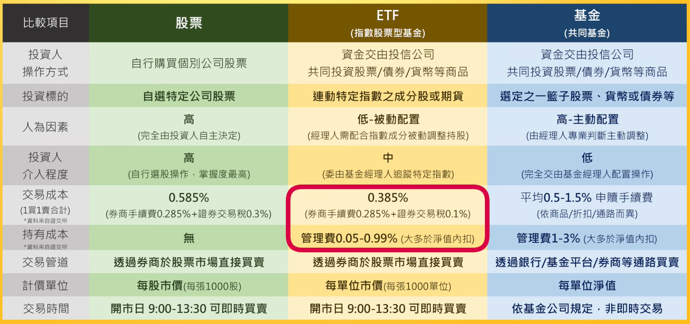

- #korean [고요](https://www.facebook.com/1764290610461911/posts/1791052651119040/)
	- 문법설명 文法說明
	  *~V,A 고요 
	  在對對方或自己所說的內容進行補充或繼續描述時使用.
	  用在動詞或形容詞語幹後.
	  가) 지금 살고 있는 하숙집은 어때요? 마음에 들어요?
	  現在住的宿舍如何? 喜歡嗎?
	  나) 네, 좋아요. 교통도 편하고요. 
	  是, 好. 交通也方便.
	  가) 그 식당 음식이 어때요?
	  那間餐廳如何?
	  나) 맛있어요, 값도 싸고요.
	  好吃, 價錢也便宜.
- #investment #zrbrosfq [ETF(指數股票型基金)](https://www.youtube.com/watch?v=HDz6xAbNQ70&list=PLrZrfGLGySzcZoVhb4idy5B0XI25ZhnF7&index=11)
	- 追蹤指數、像股票一樣交易的基金
	- 類比
		- 自選便當(e.g.: 自助餐)->股票
		- 品牌便當(e.g.: 台鐵便當)->共同基金
		- 指定便當(e.g.: 台蛋素銷5)->ETF
	- 「指數」：表徵特定族群狀態的一個量化指標，例子：
		- USDINDEX：代表美金升貶的美元指數
		- NASDAQ：代表美國科技類股表現的納斯達克指數
		- TAIEX：台股大盤的加權股價指數，表示台北股市所有上市公司的漲跌狀況
		- 指數成分股：被指數納入的公司
	- 「追蹤指數」：限定某檔基金必須根據某個指數投資特定的股票或標的
		- e.g.: 「台灣50」這個ETF是追蹤「台灣50指數」的ETF
		- 基金經理人(或機器人)會的成分股，以相同的比例持有，達到「複製」該指數的效果
		- 讓基金淨值的漲跌能貼近該指數的變化
		- 把基金以1000單位為1張，放在集中/櫃買市場像一般股票一樣讓投資人自由交易、買賣轉讓
	- 「證券化」(?)
	- 一般基金 vs ETF
		- 一般基金：透過銀行或基金平台申購、贖回，ETF：透過券商買賣交割
		- 一般基金：主動，ETF：被動
			- 一般基金(主動型基金)
				- 把錢交給基金公司(e.g.: 富蘭克林、貝萊德、摩根)
				- 由基金經理人主動幫我們選擇投資標的
				- 基金淨值漲得愈高，賣掉(贖回)就可賺到愈多價差
			- ETF(被動型基金)
				- 為了追蹤指數
				- ETF經理人(機器人)被動買進成分股
				- 投資人的主導權與透明度都較高
	- 股票 vs ETF
		- 股票：有營收、財報、本益比、股東權益可以分析，ETF：對應的不是一間公司而是一個指數，故無
	- ETF型態很多種(e.g.: 策略型、槓桿型、反向型等)，有些不見得是以指數為基礎
	- 總整理
		- 
- #investment #zrbrosfq [ETF進階篇](https://www.youtube.com/watch?v=y1WwEhg1fqk&list=PLrZrfGLGySzcZoVhb4idy5B0XI25ZhnF7&index=12)
	- 為何要買ETF而不交給基金經理人
		- 基金經理人不見得能打敗大盤，還不如被動跟著指數走就好
			- 打敗大盤：基金績效超越大盤表現
		- ETF固定成本更低、買賣也更容易
		- ETF就是「指數化投資」
		- 2008巴菲特的賭局
			- 結局：指數化投資勝過主動型基金
			- 投資不必複雜
	- ETF的類型
		- 台股、國際股(不用到國外開戶就可投資美股、陸股等)、貨幣/債券/原物料/其他
		- 原型、槓桿型、反向型
			- 以下討論的是「單日報酬」
			- 原型：實際持股
			- 槓桿型：指數漲跌x放大倍數=基金淨值漲跌
				- 台灣50正2：指數漲(跌)1%，淨值漲(跌)2%
			- 反向型：指數漲跌x負的倍數=基金淨值漲跌
				- 台灣50反1：指數漲(跌)1%，淨值跌(漲)1%
			- 槓桿型、反向型
				- 功用：融資融券的效果(?)
				- 不單純是持有成分股
				- 一部分資金會投資期貨
				- 期貨有到期轉倉(?)的成本：自動扣血
				- 因複利(?)的關係導致報酬與指數偏離
				- 結論
					- 風險較大，不適合長期持有
					- 要有信用交易帳戶才可以買賣，一般證券戶頭不可以買賣
					- 不熟悉期貨、融資券的投資者建議不要輕易嘗試
			- 原型
				- 有的ETF跟股票一樣會配息，有配的話也會除息，因此也是填息後才真正獲得股利
				- e.g.: 0050每年2月、7月配息