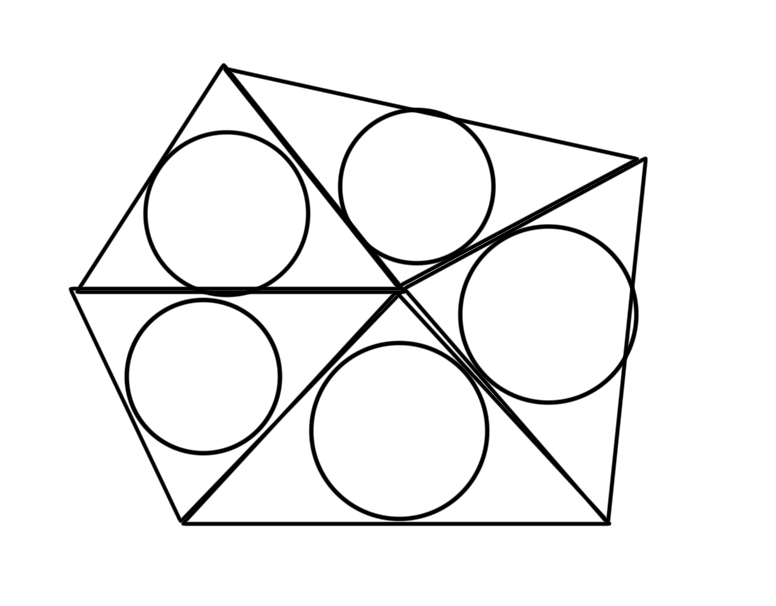

- #eda Some improvements
	- Partition: CDT?
		- VD:
			- https://upload.wikimedia.org/wikipedia/commons/d/d9/Voronoi_growth_euclidean.gif
			- more irregular
			- many cross-tile edges in a tile
				- more difficult crossing-aware search
			- only one via in each tile
				- can insert more
		- Includes circles?
			- more simple capacity model(?)
			- issue
				- cannot cover the whole routing area
				- crossing-aware implementation between circles
			- example
				- inscribed circles of DT
				- 
		- [Acute Triagulation](https://web.ntnu.edu.tw/~algo/Triangulation.html)
	- Via planning: flexible
		- Insert vias only, then move some
		- Insert both dummy and vias, then decide whether a dummy should be a via in the later stage
			- e.g. net order adjustment stage
	- Capacity model:
		- Obtuse angle
		- Feasibility (Whether success in GR guarantees success in DR)
			-
		- Back tracing (What happens before the via?)
	- Net order (in GR)
	- Congestion cost
	- Re-DT after GR (must-do)
	- DP order (in DR)