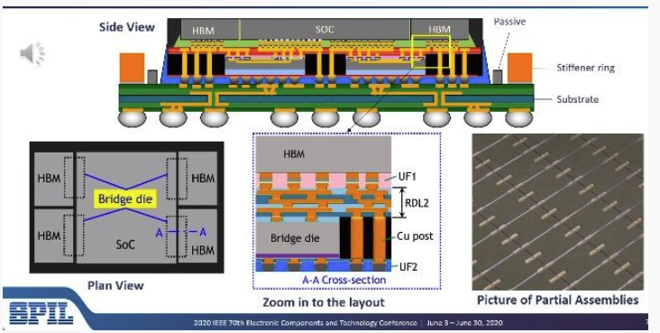

- #eda Project for next term
	- Problem formulation
		- Given
			- design rules (for both RDLs and **bridges**)
			- I/O pads
			- bump pads
			- **bridges**
			- **limit of bridge resource**
		- Connect all nets
			- Maximize routability
			- Minimize total wirelength
			- **Minimize bridge area**
			- No design rule is violated
	- Bridge structure
		- 
		- Top RDL (RDL2): orthogonal
		- Bottom RDL: octilinear
		- Numbers of RDLs are not limited
		- Cu post: Vias through bridge die layers
	- Some thoughts
		- Chung Chia's thesis might help?
		- Find some fast routing demand estimation methods
		- Just add a bridge whenever we bump into failure in routing
	- Some questions
		- Are positions of dies fixed?
		- Can a bridge not cross two dies?
		- What routing style are bridges using?