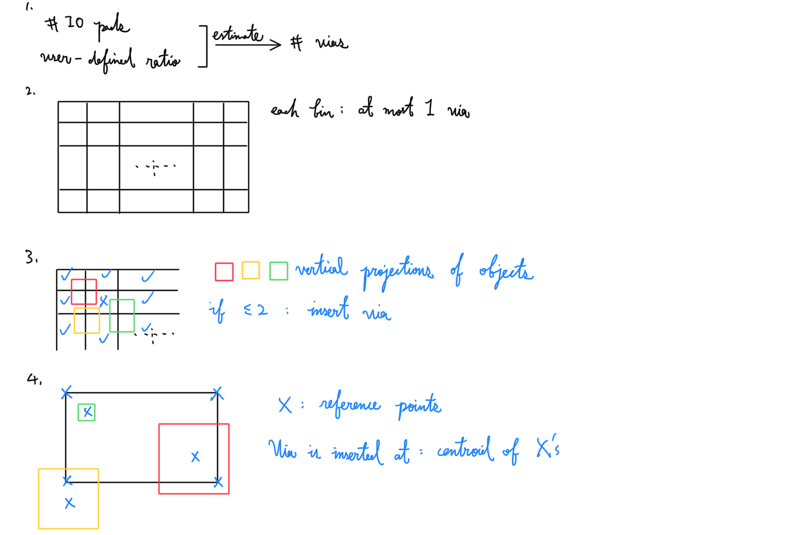
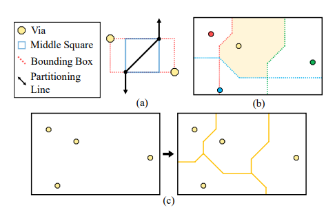
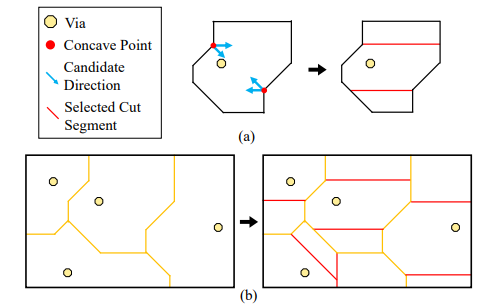

- #eda Simultaneous Pre- and Free-assignment Routing for Multiple
  Redistribution Layers with Irregular Vias
	- Terminology
	  collapsed:: true
		- PA & FA
		- Peripheral-I/O & Area-I/O
	- Motivation
	  collapsed:: true
		- Previous: handle PA and FA in two stages
		- Solution space in 2nd stage is limited by result of 1st stage
		- Routing graph has scalability issue
		  collapsed:: true
			- More partitioned regions
			- Update routing graph every time a wire or via is generated
	- RDL routing constraint
	  collapsed:: true
		- Irregular pad structure
		- X-architecture
		- Minimum spacing
		- Routing-angle constraint
	- Algorithm
		- Via Planning
		  collapsed:: true
			- {:height 473, :width 686}
		- Manhattan-Distance-Based Voronoi Diagram Construction
		  collapsed:: true
			- 
			- Generated borders suitable for X-architecture
		- Convex Cell Partitioning
		  collapsed:: true
			- 
			- Choose the cut segment with
			  collapsed:: true
				- a larger vertical projection distance from the via
				- shorter length.