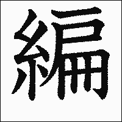

- ### Previous: [[Japanese 2]]
  collapsed:: true
-
- # 13
  collapsed:: true
	- #card 流行性感冒
	  collapsed:: true
		- インフルエンザ　５
	- #card 注射，打針
	  collapsed:: true
		- 注射　ちゅうしゃ　０
	- #card 一定要；(後接否定) 怎麼也(不)~
	  collapsed:: true
		- どうしても　１、４
	- #card 扔，丟棄
	  collapsed:: true
		- 捨てる　すてる　０　他下一
		- 
	- #card 脫掉
	  collapsed:: true
		- 脱ぐ　ぬぐ　１　他五
		- 
	- #card (時間、順序) 先
	  collapsed:: true
		- 先に　さきに　０
	- #card 點燃(火)，開啟，啟動(冷氣等電器)
	  collapsed:: true
		- （クーラーを）つける　２　他下一
	- #card 會合，碰頭
		- 待ち合わせ　まちあわせ　０
		- https://kakijun.jp/gif-mini/0961200-m.gif
	- #card 遲，耽誤；慢，晚
	  collapsed:: true
		- 遅れる　おくれる　０　自下一
	- #card 運動鞋
	  collapsed:: true
		- スニーカー　２、０
	- #card 座位，位子
	  collapsed:: true
		- 席　せき　１
	- #card 立，站；離(席)
	  collapsed:: true
		- 立つ　たつ　１　自五
	- #card 機械，機器
	  collapsed:: true
		- 機械　きかい　２
	- #card 馬上，立刻
	  collapsed:: true
		- すぐに　１
	- #card 檢查，檢驗
	  collapsed:: true
		- 検査　けんさ　１
	- #card 印刷品，講義
	  collapsed:: true
		- プリント　０
	- #card (時間) 整個~，全~
	  collapsed:: true
		- ～中　～じゅう　０
	- #card 通過，穿過
	  collapsed:: true
		- 通る　とおる　１　自五
	- #card 走廊
	  collapsed:: true
		- 廊下　ろうか　０
	- #card ~中，正在~中
	  collapsed:: true
		- ～中　～ちゅう　０
	- #card 煙火
		- 花火　はなび　１
		- https://kakijun.jp/gif-mini/hana200-m.gif
	- #card 池子
	  collapsed:: true
		- 池　いけ　２
	- #card 釣(魚)
	  collapsed:: true
		- 釣る　つる　０　他五
	- #card (時間、順序) 先
	  collapsed:: true
		- 先　さき　０
	- #card 幫助，幫忙；幫手
	  collapsed:: true
		- 手伝い　てつだい　３
	- #card 教科書
	  collapsed:: true
		- 教科書　きょうかしょ　３
	- #card 音樂會
	  collapsed:: true
		- 音楽会　おんがくかい　３、４
	- #card 禮儀，禮節
	  collapsed:: true
		- マナー　１
	- #card 半路，中途
	  collapsed:: true
		- 途中　とちゅう　０
	- #card (旅館、劇院等的)大廳
	  collapsed:: true
		- ロビー　１
	- #card 絕對
	  collapsed:: true
		- 絶対（だ）　ぜったい（だ）　０
		- 
	- #card 遵守；保衛，守護
	  collapsed:: true
		- 守る　まもる　２　他五
	- #card (人或動物的)聲音
	  collapsed:: true
		- 声　こえ　１
	- #card 剩餘；超過
	  collapsed:: true
		- 余る　あまる　２　自五
	- #card 移動；啟動；打動
	  collapsed:: true
		- 動かす　うごかす　３　他五
	- #card 投宿，住下
	  collapsed:: true
		- 泊まる　とまる　０　自五
	- #card 修好；改正；復原
	  collapsed:: true
		- 直る　なおる　２　自五
		- 
	- #card 通知
	  collapsed:: true
		- 知らせる　しらせる　０　他下一
	- #card 決定，決心
	  collapsed:: true
		- 決める　きめる　０　他下一
	- #card 換(衣服)
	  collapsed:: true
		- 着替える　きがえる　３、２　他下一
	- #card 動，移動
	  collapsed:: true
		- 動く　うごく　２　自五
	- #card 達，及；送到
	  collapsed:: true
		- 届く　とどく　２　自五
	- #card 聯絡，聯繫，通知
	  collapsed:: true
		- 連絡する　れんらくする　０　自他スル
		- 
	- #card 提出，提交
	  collapsed:: true
		- 提出する　ていしゅつする　０　他スル
	- #card 不擅長的，不善於；弱的
	  collapsed:: true
		- 弱い　よわい　２
	- #card 到達，抵達
	  collapsed:: true
		- 着く　つく　１　自五
	- #card 另外，其他
	  collapsed:: true
		- 他　ほか　０
	- #card 全體，全體人員
	  collapsed:: true
		- 全員　ぜんいん　０
	- #card 早退
	  collapsed:: true
		- 早退する　そうたいする　０　自スル
	- #card 怎麼樣了呢？
	  collapsed:: true
		- どうしたんですか　１
	- #card 外國人登錄證
	  collapsed:: true
		- 外国人登録証　がいこくじんとうろくしょう　０
	- #card 申請
	  collapsed:: true
		- 申請　しんせい　０
	- #card 回到，返回
	  collapsed:: true
		- 戻る　もどる　２　自五
		- 
	- #card 說明會
	  collapsed:: true
		- 説明会　せつめいかい　２
	- #card 健康檢查
	  collapsed:: true
		- 健康診断　けんこうしんだん　５
	- #card 哪一個都~
	  collapsed:: true
		- どちらでも　１、４
	- #card 哪裡都~
	  collapsed:: true
		- どこでも　１
	- #card 場所，地點
		- 場所　ばしょ　０
		- https://kakijun.jp/gif-mini/08118200-m.gif
	- #card 什麼時候都~
	  collapsed:: true
		- いつでも　１、３
	- #card 痛的，疼的
	  collapsed:: true
		- 痛い　いたい　２
	- #card 發燒；熱，熱度
	  collapsed:: true
		- 熱　ねつ　２
	- #card 38度半
	  collapsed:: true
		- ８度５分　はちどごぶ
	- #card (溫度、體溫) ~度
	  collapsed:: true
		- ～度　～ど
	- #card (體溫) 度的十分之一
	  collapsed:: true
		- ～分　～ぶ
	- #card (驚訝) 呃？！
	  collapsed:: true
		- ええ（っ）　２
	- #card (分配的) ~份
	  collapsed:: true
		- ～分　～ぶん
	- #card (表示對病人的的關懷) 請保重身體
	  collapsed:: true
		- お大事に　おだいじに　０
- # 14
  collapsed:: true
	- #card 禮物
	  collapsed:: true
		- プレゼント　２
	- #card 給，送(他人)
	  collapsed:: true
		- あげる　０　他下一
	- #card 領受
	  collapsed:: true
		- もらう　０　他五
	- #card 給，送(我、我們)
	  collapsed:: true
		- くれる　０　他下一
	- #card 恭喜
	  collapsed:: true
		- おめでとう　０
	- #card 花
		- 花　はな　２
		- https://kakijun.jp/gif-mini/hana200-m.gif
	- #card 餃子
	  collapsed:: true
		- ギョーザ　０
		- ギョウザ　０
	- #card 軟片，底片
	  collapsed:: true
		- フィルム　１
	- #card 錄影帶
	  collapsed:: true
		- ビデオテープ　４
	- #card 中華料理
	  collapsed:: true
		- 中華料理　ちゅうかりょうり
		- 
	- #card 主人；丈夫
	  collapsed:: true
		- 主人　しゅじん　１
	- #card 和服；衣服
	  collapsed:: true
		- 着物　きもの　０
	- #card 菸灰缸
	  collapsed:: true
		- 灰皿　はいざら　０、３
		- 
	- #card 歷史
	  collapsed:: true
		- 歴史　れきし　０
	- #card 唱片
	  collapsed:: true
		- レコード　２、１
	- #card 祖母，外祖母
	  collapsed:: true
		- 祖母　そぼ　１
	- #card 編，織
	  collapsed:: true
		- 編む　あむ　１　他五
		- 
	- #card 洗衣機
	  collapsed:: true
		- 洗濯機　せんたくき　４、３
		- 
	- #card 戒指
	  collapsed:: true
		- 指輪　ゆびわ　０
	- #card 庭院
	  collapsed:: true
		- 庭　にわ　０
	- #card 道路
	  collapsed:: true
		- 道　みち　０
	- #card 獎學金
	  collapsed:: true
		- 奨学金　しょうがくきん　０
	- #card 傳真
	  collapsed:: true
		- ファックス　１
	- #card 祝賀，賀辭；賀禮
	  collapsed:: true
		- お祝い　おいわい　０
	- #card 入學申請書，入學報名表
	  collapsed:: true
		- 入学願書　にゅうがくがんしょ　５
	- #card 遠足，郊遊
		- 遠足　えんそく　０
		- https://kakijun.jp/gif-mini/1339200-m.gif
	- #card 大使館
	  collapsed:: true
		- 大使館　たいしかん　３
	- #card 簽證
	  card-last-interval:: -1
	  card-repeats:: 1
	  card-ease-factor:: 2.5
	  card-next-schedule:: 2022-07-14T16:00:00.000Z
	  card-last-reviewed:: 2022-07-14T06:35:15.381Z
	  card-last-score:: 1
	  collapsed:: true
		- ビザ　１
	- #card 風景明信片，插圖明信片
		- 絵葉書　えはがき　２
		- https://kakijun.jp/gif-mini/12179200-m.gif
		- https://kakijun.jp/gif-mini/1257200-m.gif
	- #card 信封
	  collapsed:: true
		- 封筒　ふうとう　０
	- #card 預約，預訂
		- 予約する　よやくする　０　他スル
		- https://kakijun.jp/gif-mini/09177200-m.gif
	- #card 小說
	  collapsed:: true
		- 小説　しょうせつ　０
	- #card ~的方法
	  collapsed:: true
		- ～方　～かた
	- #card 做法，製作方法
	  collapsed:: true
		- 作り方　つくりかた　５、４
	- #card [謙稱] 妻子，內人
	  collapsed:: true
		- 家内　かない　１
	- #card 鋼筆
	  collapsed:: true
		- 万年筆　まんねんひゆ　３
	- #card 子女；小孩，孩童
	  collapsed:: true
		- 子　こ　０
	- #card 兒童繪本，兒童圖畫書
	  collapsed:: true
		- 絵本　えほん　２
		- https://kakijun.jp/gif-mini/12179200-m.gif
	- #card 祖父，外祖父
	  collapsed:: true
		- 祖父　そふ　１
	- #card 瑞士
	  collapsed:: true
		- スイス　１
	- #card 贈送
	  collapsed:: true
		- 贈る　おくる　０　他五
		- 
	- #card 寄，送，匯；送，送行
	  collapsed:: true
		- 送る　おくる　０　他五
	- #card 手機吊飾
	  collapsed:: true
		- ストラップ　３
	- #card 花束
		- 花束　はなたば　２、３
		- https://kakijun.jp/gif-mini/hana200-m.gif
	- #card 聖誕卡
	  collapsed:: true
		- クリスマスカード　６
	- #card 鑰匙圈
	  collapsed:: true
		- キーホルダー　３
	- #card 手套
	  collapsed:: true
		- 手袋　てぶくろ　２
	- #card 玩具
	  collapsed:: true
		- おもちゃ　２
	- #card 修理；訂正，修改
	  collapsed:: true
		- 直す　なおす　２　他五
		- 
	- #card 放學後
	  collapsed:: true
		- 放課後　ほうかご　０
	- #card 圍巾
	  collapsed:: true
		- マフラー　１
	- #card 編織；針織品
	  collapsed:: true
		- 編み物　あみもの　２
		- 
	- #card 合適，相稱
	  collapsed:: true
		- 似合う　にあう　２　自五
	- #card 開心的，歡喜的
	  collapsed:: true
		- うれしい　３
	- #card 園藝
	  collapsed:: true
		- ガーデニング　０
	- #card 茶道
	  collapsed:: true
	  card-last-interval:: 4
	  card-repeats:: 1
	  card-ease-factor:: 2.6
	  card-next-schedule:: 2022-07-22T13:36:40.841Z
	  card-last-reviewed:: 2022-07-18T13:36:40.841Z
	  card-last-score:: 5
		- 茶道　さどう　１
		- https://kakijun.jp/gif-mini/0967200-m.gif
	- #card 書法
	  collapsed:: true
	  card-last-interval:: 4
	  card-repeats:: 1
	  card-ease-factor:: 2.36
	  card-next-schedule:: 2022-07-26T14:11:00.029Z
	  card-last-reviewed:: 2022-07-22T14:11:00.030Z
	  card-last-score:: 3
		- 書道　しょどう　１
	- #card 柔道
	  collapsed:: true
		- 柔道　じゅうどう　１
	- #card (程度)驚人的，厲害的；可怕的
	  collapsed:: true
		- すごい　２
	- #card 做
	  collapsed:: true
		- やる　０　他五
	- #card 會話，對話
	  collapsed:: true
		- 会話　かいわ　０
	- #card 次，下一(個)
	  collapsed:: true
		- 次　つぎ　２
	- #card 挑選
	  collapsed:: true
		- 選ぶ　えらぶ　２　他五
		- 
	- #card 國內
	  collapsed:: true
		- 国内　こくない　２
	- #card 真好啊！
		- いいなあ　１
	- #card 大概，或許
	  collapsed:: true
		- たぶん　１
	- #card 交通費
	  collapsed:: true
		- 交通費　こうつうひ　３
	- #card 暑假
	  collapsed:: true
		- 夏休み　なつやすみ　３
	- #card 那麼
	  collapsed:: true
		- じゃあ　１
	- #card 遊覽，觀賞
	  collapsed:: true
		- 見物　けんぶつ　０
	- #card 擅長的
	  collapsed:: true
		- 得意（だ）　とくい（だ）　２、０
	- #card 剛才
	  collapsed:: true
		- さっき　１
	- #card [略語] 手機；攜帶
	  collapsed:: true
		- 携帯　けいたい　０
	- #card 鳴，響，發出聲音
	  collapsed:: true
		- 鳴る　なる　０　自五
	- #card 她；女朋友
	  collapsed:: true
		- 彼女　かのじょ　１
	- #card 謝意；謝禮
	  collapsed:: true
		- お礼　おれい　０
	- #card 替換
	  collapsed:: true
		- かわる　０　自五
- # 15
  collapsed:: true
	- #card 事；[形式名詞] (使前述動詞作名詞化)
	  collapsed:: true
		- こと　２
	- #card 成為，變成；(時間、數值)到
	  collapsed:: true
		- なる　１　自五
	- #card (能力、可能性)能，會
	  collapsed:: true
		- できる　２　自上一
	- #card (花)開
		- 咲く　さく　０　自五
	- #card 不便，不便利
	  collapsed:: true
		- 不便（だ）　ふべん（だ）　１
	- #card 醫生
	  collapsed:: true
		- 医者　いしゃ　０
	- #card 入學考試
	  collapsed:: true
		- 入学試験　にゅうがくしけん　５、６
	- #card 合格，考上；符合標準
	  collapsed:: true
		- 合格する　ごうかくする　０　自スル
	- #card 普通，平凡
	  collapsed:: true
		- 普通　ふつう　０
	- #card 往昔，從前
	  collapsed:: true
		- 昔　むかし　０
	- #card (房屋)~間，~棟
	  collapsed:: true
		- ～軒　～けん
	- #card 部長，部門主管，經理
	  collapsed:: true
		- 部長　ぶちょう　０
	- #card 烤；燒，焚
	  collapsed:: true
		- 焼く　やく　０　他五
	- #card 夢想，願望；夢
	  collapsed:: true
		- 夢　ゆめ　２
		- 
	- #card 社長，總經理
	  collapsed:: true
		- 社長　しゃちょう　０
	- #card 自己
	  collapsed:: true
		- 自分　じぶん　０
	- #card 通譯，口譯
	  collapsed:: true
		- 通訳　つうやく　１
	- #card 小說家
	  collapsed:: true
		- 小説家　しょうせつか　０
	- #card 申請，報名；請求
	  collapsed:: true
		- 申し込み　もうしこみ　０
	- #card 提領(存款)；放低，移下
	  collapsed:: true
		- 下ろす　おろす　２　他五
	- #card 專長，拿手絕活
	  collapsed:: true
	  card-last-interval:: -1
	  card-repeats:: 1
	  card-ease-factor:: 2.5
	  card-next-schedule:: 2022-07-22T16:00:00.000Z
	  card-last-reviewed:: 2022-07-22T14:11:22.526Z
	  card-last-score:: 1
		- 特技　とくぎ　１
	- #card 魔術
	  collapsed:: true
		- 手品　てじな　１
	- #card (木製玩具) 劍球，日月球
	  collapsed:: true
		- けん玉　けんだま　０
	- #card 摺紙 (手藝)
	  collapsed:: true
		- 折り紙　おりがみ　２
	- #card 繞口令
		- 早口言葉　はやくちことば　５
		- https://kakijun.jp/gif-mini/1257200-m.gif
	- #card 公里
	  collapsed:: true
		- キロメートル　３
		- キロ　１
	- #card 鍵盤
	  collapsed:: true
		- キーボード　３
	- #card 打，拍，敲
	  collapsed:: true
		- 打つ　うつ　１　他五
	- #card 寵物
	  collapsed:: true
		- ペット　１
	- #card 卡片
	  collapsed:: true
		- カード　１
	- #card 國際 (國際電話)
	  collapsed:: true
		- 国際　こくさい　０　（国際電話　こくさいでんわ　５）
		- https://kakijun.jp/gif-mini/13165200-m.gif
	- #card 網咖，網路咖啡店
	  collapsed:: true
		- インターネットカフェ　８
	- #card 變更，更改
	  collapsed:: true
		- 変更　へんこう　０
	- #card (機構的)窗口，櫃檯
	  collapsed:: true
		- 窓口　まどぐち　２
	- #card 兌換(貨幣)，換錢
	  collapsed:: true
		- 両替　りょうがえ　０
	- #card (設有投幣式洗衣機的)自助洗衣店
	  collapsed:: true
		- コインランドリー　４
	- #card 取消
	  collapsed:: true
		- キャンセルする　１　他スル
	- #card 手續費
	  collapsed:: true
		- 手数料　てすうりょう　２
	- #card 定價
	  collapsed:: true
		- 定価　ていか　０
	- #card 百分比
	  collapsed:: true
		- パーセント　３
	- #card 怎麼辦呢？
	  collapsed:: true
		- どうしようかな　１
	- #card 申請，報名
	  collapsed:: true
		- 申し込む　もうしこむ　４　他五
	- #card 糖，砂糖
	  collapsed:: true
		- 砂糖　さとう　２
	- #card 甜的，有甜味的
	  collapsed:: true
		- 甘い　あまい　０
	- #card 筆直；直接
	  collapsed:: true
		- まっすぐ　３
	- #card 左，左邊
	  collapsed:: true
		- 左　ひだり　０
	- #card (道路的)轉角，稜角
	  collapsed:: true
		- 角　かど　１
	- #card 轉彎，拐彎；彎，彎曲
	  collapsed:: true
		- 曲がる　まがる　０　自五
	- #card 交通號誌；信號
	  collapsed:: true
		- 信号　しんごう　０
	- #card 馬上，立刻
	  collapsed:: true
		- すぐ　１
	- #card 命中，中獎
	  collapsed:: true
		- 当たり　あたり　０
	- #card 再一個
	  collapsed:: true
		- もう一つ　もうひとつ　４
	- #card 鬧鐘
	  collapsed:: true
		- 目覚まし時計　めざましどけい　５
		- https://kakijun.jp/gif-mini/10114200-m.gif
	- #card 裝配，調整
	  collapsed:: true
		- セットする　１　他スル
	- #card 注意，留神，小心
	  collapsed:: true
		- 気をつける　きをつける　４
	- #card 交通事故，車禍
	  collapsed:: true
		- 交通事故　こうつうじこ　５
	- #card 遇上，遭逢(交通事故等)
	  collapsed:: true
		- （交通事故に）遭う　（こうつうじこに）あう　１　自五
	- #card 天空，空中
	  collapsed:: true
	  card-last-interval:: 4
	  card-repeats:: 1
	  card-ease-factor:: 2.6
	  card-next-schedule:: 2022-07-22T13:36:45.889Z
	  card-last-reviewed:: 2022-07-18T13:36:45.889Z
	  card-last-score:: 5
		- 空　そら　１
	- #card 逐漸
	  collapsed:: true
		- だんだん　０
	- #card 扭蛋，轉蛋
	  collapsed:: true
		- ガチャポン　０
	- #card 如何(做)，怎樣(做)
	  collapsed:: true
		- どうやって　１
	- #card (長柄的)把手
	  collapsed:: true
		- レバー　１
	- #card 轉動
	  collapsed:: true
		- 回す　まわす　０　他五
	- #card 大頭貼
	  collapsed:: true
		- プリクラ　０
	- #card 貼紙
	  collapsed:: true
		- シール　１
	- #card 日式，和式
	  collapsed:: true
		- 和風　わふう　０
	- #card 廚房
	  collapsed:: true
		- キッチン　１
	- #card 大廳；會堂，會場
	  collapsed:: true
		- ホール　１
	- #card 時薪
	  collapsed:: true
		- 時給　じきゅう　０
	- #card 廣告，宣傳
	  collapsed:: true
		- 広告　こうこく　０
	- #card 一週，星期
	  collapsed:: true
		- 週　しゅう　１
	- #card 電話號碼
	  collapsed:: true
		- 電話番号　でんわばんごう　４
		- https://kakijun.jp/gif-mini/13165200-m.gif
	- #card [まだ的強調形] 還，仍
	  collapsed:: true
		- まだまだ　１
	- #card (後接否定) 怎麼也(不)；很
	  collapsed:: true
		- なかなか　０
	- #card 各種，各式各樣
	  collapsed:: true
		- いろいろ（だ）　０
	- #card 外國 (外語)
	  collapsed:: true
		- 外国　がいこく　０　（外国語　がいこくご　０）
	- #card 嚴格的，嚴厲的
	  collapsed:: true
		- 厳しい　きびしい　３
- # 16
  collapsed:: true
	- #card 相撲
	  collapsed:: true
		- 相撲　すもう　０
	- #card 期待；樂趣
	  collapsed:: true
		- 楽しみ（だ）　たのしみ（だ）　３、４、０
	- #card 富士山
	  collapsed:: true
		- 富士山　ふじさん　１
	- #card 登，上(高處)
	  collapsed:: true
		- 登る　のぼる　０　自五
	- #card 納豆
	  collapsed:: true
		- 納豆　なっとう　３
	- #card 通宵，熬夜
	  collapsed:: true
		- 徹夜　てつや　０
		- 
	- #card (餐廳、旅館) 三星級
	  collapsed:: true
		- 三つ星　みつぼし　２
	- #card ~次
	  collapsed:: true
		- ～度　～ど
	- #card 幽靈
	  collapsed:: true
		- 幽霊　ゆうれい　１
		- 
	- #card 謊言
	  collapsed:: true
		- うそ　１
	- #card 玩笑，笑話
	  collapsed:: true
		- 冗談　じょうだん　３
	- #card 外星人
	  collapsed:: true
		- 宇宙人　うちゅうじん　２
	- #card 飛碟，幽浮，不明飛行體
	  collapsed:: true
		- UFO　ユーフォー
	- #card 複習
	  collapsed:: true
		- 復習する　ふくしゅうする　０　他スル
	- #card 問(問題)，發問
	  collapsed:: true
		- 質問する　しつもんする　０　自スル
	- #card 平日，工作日；平時
	  collapsed:: true
		- 平日　へいじつ　０
	- #card 新年，過年期間
	  collapsed:: true
		- お正月　おしょうがつ　０
	- #card 親戚
	  collapsed:: true
		- 親戚　しんせき　０
	- #card 年菜
	  collapsed:: true
		- おせち料理　おせちりょうり　４
	- #card 長笛
	  collapsed:: true
		- フルート　２
	- #card 樂器
	  collapsed:: true
		- 楽器　がっき　０
		- 
	- #card 演奏
	  collapsed:: true
		- 演奏する　えんそうする　０
	- #card 電燈；電能；電力
	  collapsed:: true
		- 電気　でんき　１
	- #card 時間，時候；時期
	  collapsed:: true
		- ～とき
	- #card 接受；收，接
	  collapsed:: true
		- 受ける　うける　２　他下一
	- #card [略語] 預約，約定(會面)
	  collapsed:: true
		- アポイント　２
	- #card 護照
	  collapsed:: true
		- パスポート　３
	- #card 工作許可證
	  collapsed:: true
		- 資格外活動許可書　しかくがいかつどうきょかしょ　０、１２
	- #card 學生證
	  collapsed:: true
		- 学生証　がくせいしょう　０
	- #card 首先
	  collapsed:: true
		- 始めに　はじめに　０
	- #card 性格，個性；性質
	  collapsed:: true
		- 性格　せいかく　０
	- #card 水準，程度
	  collapsed:: true
		- レベル　１
	- #card 清楚地，明確地
	  collapsed:: true
		- はっきり　３
	- #card 回答
	  collapsed:: true
		- 答える　こたえる　３、２　自下一
	- #card 抱歉…，對不起…
	  collapsed:: true
		- すみませんが　４
	- #card 廚房
	  collapsed:: true
		- 台所　だいどころ　０
	- #card 將來
	  collapsed:: true
		- 将来　しょうらい　１
	- #card [略語] 中學
	  collapsed:: true
		- 中学　ちゅうがく　１
	- #card 畢業
	  collapsed:: true
		- 卒業する　そつぎょうする　０　自スル
	- #card [略語] 高中
	  collapsed:: true
		- 高校　こうこう　０
	- #card 難受的，痛苦的
	  collapsed:: true
		- つらい　０
	- #card 為什麼
	  collapsed:: true
		- どうして　１
	- #card 即將，快要
	  collapsed:: true
		- もうすぐ　３
	- #card 山
	  collapsed:: true
		- 山　やま　２
	- #card 很，甚，極
	  collapsed:: true
		- だいぶ　０
	- #card 習慣，適應；熟練
	  collapsed:: true
		- 慣れる　なれる　２　自下一
- # 17
  collapsed:: true
	- #card 想，認為，覺得
	  collapsed:: true
		- 思う　おもう　２　他五
	- #card 大會
	  collapsed:: true
		- 大会　たいかい　０
	- #card 危險的，危急的
	  collapsed:: true
		- 危ない　あぶない　０、３
	- #card (飲料名) 可樂
	  collapsed:: true
		- コーラ　１
	- #card (應答) 嗯，是
	  collapsed:: true
		- うん　１
	- #card (應答) 不，不是
	  collapsed:: true
		- ううん　２
	- #card 早
	  collapsed:: true
		- おはよう　０
	- #card 午安，您好
	  collapsed:: true
		- こんにちわ　５
	- #card 再見，再會
	  collapsed:: true
		- さようなら　４、５
		- さよなら　３、４
	- #card 辛苦了
	  collapsed:: true
		- お疲れ様　おつかれさま　０
	- #card (睡前) 晚安
	  collapsed:: true
		- お休みなさい　おやすみなさい　６
	- #card 別來無恙，您好嗎
	  collapsed:: true
		- お元気ですか　おげんきですか　２
	- #card 不客氣，別客氣
	  collapsed:: true
		- どういたしまして　１
	- #card 分別，分離
	  collapsed:: true
		- 別れる　わかれる　３　自下一
	- #card 文件
	  collapsed:: true
		- 書類　しょるい　０
		- 
	- #card 交付，交給，遞給
	  collapsed:: true
		- 渡す　わたす　０　他五
	- #card 世界
	  collapsed:: true
		- 世界　せかい　１
	- #card (空間、範圍)整個~，全~
	  collapsed:: true
		- ～中　～じゅう　０
	- #card 趕得上，來得及
	  collapsed:: true
		- 間に合う　まにあう　３　自五
	- #card 贏，勝利
	  collapsed:: true
		- 勝つ　かつ　１　自五
	- #card 減肥
	  collapsed:: true
		- ダイエット　１
	- #card 總理大臣，首相
	  collapsed:: true
		- 総理大臣　そうりだいじん　４
		- 
	- #card 尚可，還可以
	  collapsed:: true
		- まあまあ（だ）　１、３
	- #card [略語] 動畫
	  collapsed:: true
		- アニメ　１、０
	- #card 故事；故事情節
	  collapsed:: true
		- ストーリー　２
	- #card 上下班尖峰時間
		- 通勤ラッシュ　つうきんラッシュ　５
		- https://kakijun.jp/gif-mini/1210200-m.gif
	- #card 都會，都市
	  collapsed:: true
		- 都会　とかい　０
	- #card 沒辦法，無可奈何
	  collapsed:: true
		- 仕方が無い　しかたがない
	- #card 社會
	  collapsed:: true
		- 社会　しゃかい　１
	- #card 可怕的，令人害怕的
	  collapsed:: true
		- 怖い　こわい　２
	- #card 平時，平常
	  collapsed:: true
		- 日頃　ひごろ　０
	- #card 行為，舉止
	  collapsed:: true
		- 行い　おこない　０
	- #card 一定
	  collapsed:: true
		- きっと　０
	- #card 怎麼樣的
	  collapsed:: true
		- どういう　１
	- #card 意思，意義
	  collapsed:: true
		- 意味　いみ　１
	- #card 是嗎，這樣啊
	  collapsed:: true
		- そうか　１
	- #card 喂！(親暱地招喚、叮囑)
	  collapsed:: true
		- ねえ　１
	- #card 戲劇
	  collapsed:: true
		- ドラマ　１
	- #card [口語] 非常
	  collapsed:: true
		- とっても　０
	- #card 說實在的，其實
	  collapsed:: true
		- 実は　じつは　２
	- #card 好啊！可以啊！(上升語調)
	  collapsed:: true
		- いいわよ　１
	- #card 突然的
	  collapsed:: true
		- 急（だ）　きゅう（だ）　０
		- 
	- #card 改變，變化
	  collapsed:: true
		- 変わる　かわる　０　自五
	- #card (心)撲通撲通地跳
	  collapsed:: true
		- ドキドキする　１　自スル
	- #card 主角，主人翁
	  collapsed:: true
		- 主人公　しゅじんこう　２
	- #card 哦！(察覺某事、驚訝)
	  collapsed:: true
	  card-last-interval:: 4
	  card-repeats:: 1
	  card-ease-factor:: 2.6
	  card-next-schedule:: 2022-07-26T14:09:00.549Z
	  card-last-reviewed:: 2022-07-22T14:09:00.552Z
	  card-last-score:: 5
		- おっ　１
	- #card 好呀，好啊
	  collapsed:: true
		- いいね　１
	- #card 不用了(下降語調，表拒絕)
	  collapsed:: true
		- いいよ　１
	- #card 我(男性對同輩、晚輩自稱)
	  collapsed:: true
		- 俺　おれ　０
	- #card 外面
	  collapsed:: true
		- 外　そと　１
	- #card 不用了(下降語調，表拒絕)
	  collapsed:: true
		- いいですよ　１
	- #card (天空)陰，變陰
		- 曇る　くもる　２　自五
		- https://kakijun.jp/gif-mini/1629200-m.gif
	- #card 颱風
	  collapsed:: true
		- 台風　たいふう　３
	- #card 星星
	  collapsed:: true
		- 星　ほし　０
	- #card 加班
	  collapsed:: true
		- 残業　ざんぎょう　０
- # 18
  collapsed:: true
	- #card [敬稱] 祖母，外婆；老婆婆
	  collapsed:: true
		- おばあさん　２
	- #card 出生，誕生
	  collapsed:: true
		- 生まれる　うまれる　０　自下一
	- #card [敬稱] 伯伯，叔叔，舅舅，姑丈，姨丈
	  collapsed:: true
		- 伯父さん　おじさん　０
		- 叔父さん　おじさん　０
	- #card [敬稱] 祖父，外公；老爺爺
	  collapsed:: true
		- おじいさん　２
	- #card 伯母，嬸嬸，舅媽，姑姑，阿姨
	  collapsed:: true
		- 伯母　おば　０
		- 叔母　おば　０
	- #card [敬稱] 伯母，嬸嬸，舅媽，姑姑，阿姨
	  collapsed:: true
		- 伯母さん　おばさん　０
		- 叔母さん　おばさん　０
	- #card 舉起，抬起(手)
	  collapsed:: true
		- （手を）上げる　（てを）あげる　０　他下一
	- #card 答案，解答；回答，答覆
	  collapsed:: true
		- 答え　こたえ　２
	- #card 旁邊，附近
	  collapsed:: true
		- そば　１
	- #card 試穿
	  collapsed:: true
		- 試着する　しちゃくする　０　他スル
	- #card 大掃除
	  collapsed:: true
		- 大掃除　おおそうじ　３
		- 
	- #card 電腦軟體
	  collapsed:: true
		- コンピューターソフト　７
	- #card 任職，服務
		- 勤める　つとめる　３　他下一
		- https://kakijun.jp/gif-mini/1210200-m.gif
	- #card 海外，國外
	  collapsed:: true
		- 海外　かいがい　１
		- https://kakijun.jp/gif-mini/09124200-m.gif
	- #card 履歷表
	  collapsed:: true
		- 履歴書　りれきしょ　０、４
	- #card 沾濕，淋濕
	  collapsed:: true
		- ぬれる　０　自下一
	- #card 晒乾，晾乾，烘乾
	  collapsed:: true
		- 乾かす　かわかす　３　他五
	- #card 道路，公路
	  collapsed:: true
		- 道路　どうろ　１
	- #card 滑，滑倒；滑行
	  collapsed:: true
		- 滑る　すべる　２　自五
		- 
	- #card 注意，當心；提醒，警告
	  collapsed:: true
		- 注意する　ちゅういする　１　自スル
	- #card 身心感受；情緒；氣氛，雰圍
	  collapsed:: true
		- 気分　きぶん　１
	- #card 那麼，那樣
	  collapsed:: true
		- そう　０
	- #card 空氣
	  collapsed:: true
		- 空気　くうき　１
	- #card 初次，第一次
	  collapsed:: true
		- 初めて　はじめて　２
	- #card 商量，商談
	  collapsed:: true
		- 相談　そうだん　０
	- #card 要怎麼做，該怎麼做
	  collapsed:: true
		- どうすれば　１
	- #card 首先
	  collapsed:: true
		- まず　１
	- #card (一個)月
	  collapsed:: true
		- 月　つき　２
	- #card 管理費
	  collapsed:: true
		- 管理費　かんりひ　３
	- #card 必須，必要
	  collapsed:: true
		- 必要（だ）　ひつよう（だ）　０
	- #card 押金
	  collapsed:: true
		- 敷金　しききん　２
		- 
	- #card 禮金，作為禮物的現金
	  collapsed:: true
		- 礼金　れいきん　０
	- #card 最初，首先
	  collapsed:: true
		- 最初　さいしょ　０
		- https://kakijun.jp/gif-mini/12107200-m.gif
	- #card 那樣的
	  collapsed:: true
		- そんな　０
	- #card 從現在起，今後
	  collapsed:: true
		- これから　０
	- #card 啊~ (表失望)
	  collapsed:: true
		- あーあ　２
	- #card 保證金
	  collapsed:: true
		- 保証金　ほしょうきん　０
	- #card 回歸，重返本源
	  collapsed:: true
		- 返る　かえる　１　自五
	- #card [敬稱] 房東
	  collapsed:: true
		- 大家さん　おおやさん　１
	- #card 病，疾病
	  collapsed:: true
		- 病気　びょうき　０
	- #card 地震
	  collapsed:: true
		- 地震　じしん　０
		- 
	- #card 髒的，骯髒的
	  collapsed:: true
		- 汚い　きたない　３
	- #card 留學
	  collapsed:: true
		- 留学する　りゅうがくする　０　自スル
	- #card 感到困擾，為難
	  collapsed:: true
		- 困る　こまる　２　自五
	- #card 諮詢人員，(技術)支援人員
	  collapsed:: true
		- サポート係　サポートがかり　５
	- #card 再啟動，重新開機
	  collapsed:: true
		- 再起動する　さいきどうする　３　自他スル
		- https://kakijun.jp/gif-mini/10215200-m.gif
	- #card 遠處，遠方
		- 遠く　とおく　３
		- https://kakijun.jp/gif-mini/1339200-m.gif
	- #card (花)盛開
	  collapsed:: true
		- 満開　まんかい　０
	- #card 遺憾的，可惜的
	  collapsed:: true
		- 残念（だ）　ざんねん（だ）　３
	- #card 賞(櫻)花
		- 花見　はなみ　３
		- https://kakijun.jp/gif-mini/hana200-m.gif
	- #card 愛惜的，重要的
	  collapsed:: true
		- 大切（だ）　たいせつ（だ）　０
	- #card 正中央
		- 真ん中　まんなか　０
		- https://kakijun.jp/gif-mini/10167200-m.gif
	- #card 祖父母
	  collapsed:: true
		- 祖父母　そふぼ　２
- # 19
  collapsed:: true
	- #card 參考書
	  collapsed:: true
		- 参考書　さんこうしょ　０、５
	- #card 強的，有力的
	  collapsed:: true
		- 強い　つよい　２
	- #card 風
	  collapsed:: true
		- 風　かぜ　０
	- #card 倒，塌；倒閉；病倒
	  collapsed:: true
		- 倒れる　たおれる　３　自下一
	- #card 事故
	  collapsed:: true
		- 事故　じこ　１
	- #card 小論文
	  collapsed:: true
		- 小論文　しょうろんぶん　３
	- #card 以上
	  collapsed:: true
		- 以上　いじょう　１
	- #card 成功
	  collapsed:: true
		- 成功する　せいこうする　０　自スル
	- #card 迷你裙
	  collapsed:: true
		- ミニスカート　４
	- #card 彩券
	  collapsed:: true
		- 宝くじ　たからくじ　３、４
	- #card 中獎；命中；碰撞
	  collapsed:: true
		- 当たる　あたる　０　自五
	- #card 世界一周
	  collapsed:: true
		- 世界一周　せかいいっしゅう
	- #card 飛行員
	  collapsed:: true
		- パイロット　３、１
	- #card 繼續；使相連
	  collapsed:: true
		- 続ける　つづける　０　他下一
		- 
	- #card 胖
	  collapsed:: true
		- 太る　ふとる　２　自五
	- #card 帥的，酷的
	  collapsed:: true
		- かっこいい　４
	- #card 有錢人
		- お金持ち　おかねもち　０、４
		- https://kakijun.jp/gif-mini/0991200-m.gif
	- #card 建造
	  collapsed:: true
		- 建つ　たつ　自五
	- #card 售出，(暢)銷；有名氣
	  collapsed:: true
		- 売れる　うれる　０　自下一
	- #card 外國車，外國製汽車
	  collapsed:: true
		- 外車　がいしゃ　０
	- #card 故鄉
	  collapsed:: true
		- 故郷　こきょう　１
	- #card 近代的
	  collapsed:: true
		- 近代的（だ）　きんだいてき（だ）　０
	- #card 務必，一定
	  collapsed:: true
		- ぜひ　１
	- #card 港都
	  collapsed:: true
		- 港町　みなとまち　３
		- https://kakijun.jp/gif-mini/12133200-m.gif
	- #card 丟垃圾
	  collapsed:: true
		- ゴミ捨て　ゴミすて　０、２
		- 
	- #card [敬稱] 夫人，太太
	  collapsed:: true
		- 奥さん　おくさん　１
	- #card 哎呀，唉唷 (使用者多為女性)
	  collapsed:: true
		- あら（っ）　１
	- #card 瓶
	  collapsed:: true
		- 瓶　びん　１
	- #card 然而，可是
	  collapsed:: true
		- だけど　１
	- #card 燃燒
	  collapsed:: true
		- 燃える　もえる　０　自下一
	- #card 嗯… (無法立即說出想說的話時，沉思時使用)
	  collapsed:: true
		- うーん　０
	- #card 罐；罐頭
	  collapsed:: true
		- 缶　かん　１
	- #card 不行的；無用的，白費的
	  collapsed:: true
		- だめ（だ）　２
	- #card 盒子
	  collapsed:: true
		- パック　１
	- #card 搞錯，弄錯
	  collapsed:: true
		- 間違える　まちがえる　４、３　他下一
	- #card 棉被，被褥
	  collapsed:: true
		- 布団　ふとん　０
	- #card 正確的
	  collapsed:: true
		- 正しい　ただしい　３
	- #card 面紙
	  collapsed:: true
		- ティッシュ　１
		- ティッシュペーパー　４
	- #card 努力，奮鬥
	  collapsed:: true
		- 頑張る　がんばる　３　自五
	- #card 得冠軍，優勝
	  collapsed:: true
		- 優勝する　ゆうしょうする　０　自スル
	- #card 大雨
	  collapsed:: true
		- 大雨　おおあめ　３
	- #card 中止，取消
	  collapsed:: true
		- 中止　ちゅうし　０
	- #card 足球場
	  collapsed:: true
		- サッカー場　サッカーじょう　０
-
- ### Next: [[Japanese 4]]