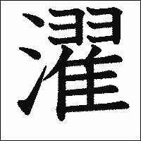

- ### Previous: [[Japanese 3]]
-
- # 20
  collapsed:: true
	- #card 閉，關閉
	  collapsed:: true
		- 閉まる　しまる　２　自五
	- #card 開
	  collapsed:: true
		- 開く　あく　０　自五
	- #card 熄滅；消失
	  collapsed:: true
		- 消える　きえる　０　自下一
		- https://kakijun.jp/gif-mini/10144200-m.gif
	- #card 流，流動；傳播
	  collapsed:: true
		- 流れる　ながれる　３　自下一
	- #card (火、燈)點著，點亮；(電器)開啟
	  collapsed:: true
		- つく　１　自五
	- #card 使流動；散布
	  collapsed:: true
		- 流す　ながす　２　他五
	- #card 使落下；丟失
	  collapsed:: true
		- 落とす　おとす　２　他五
		- 
	- #card 落下；遺失；降低，減弱，低落
	  collapsed:: true
		- 落ちる　おちる　２　自上一
		- 
	- #card 打碎，打破；稀釋；(數學) 除
	  collapsed:: true
		- 割る　わる　０　他五
	- #card 破，碎，裂；破裂
	  collapsed:: true
		- 割れる　われる　０　自下一
	- #card 脫落；消除
	  collapsed:: true
		- 取れる　とれる　２　自下一
	- #card 停止，止住
	  collapsed:: true
		- 止まる　とまる　０　自五
	- #card 壞，碎，倒塌
	  collapsed:: true
		- 壊れる　こわれる　３　自下一
	- #card 乾，乾燥
	  collapsed:: true
		- 乾く　かわく　２　自五
	- #card 洗好的衣物；待洗衣物
	  card-last-interval:: -1
	  card-repeats:: 1
	  card-ease-factor:: 2.5
	  card-next-schedule:: 2022-07-22T16:00:00.000Z
	  card-last-reviewed:: 2022-07-22T14:09:54.238Z
	  card-last-score:: 1
	  collapsed:: true
		- 洗濯物　せんたくもの　０
		- 
	- #card 吹風機
	  collapsed:: true
		- ドライヤー　０、２
	- #card 蓋子
	  collapsed:: true
		- ふた　０
	- #card 窗玻璃
	  collapsed:: true
		- 窓ガラス　まどガラス　３
	- #card 玻璃
	  collapsed:: true
		- ガラス　０
	- #card 弄倒；打倒
	  collapsed:: true
		- 倒す　たおす　２　他五
	- #card 前些日子，前幾天
	  collapsed:: true
		- 先日　せんじつ
	- #card (椅子的)靠背
	  collapsed:: true
		- 背もたれ　せもたれ　２
		- https://kakijun.jp/gif-mini/09186200-m.gif
	- #card 抽屜
	  collapsed:: true
		- 引き出し　ひきだし　０
	- #card 髒，不潔
	  collapsed:: true
		- 汚れる　よごれる　０　自下一
	- #card 弄髒
	  collapsed:: true
		- 汚す　よごす　０　他五
	- #card 袋子
	  collapsed:: true
		- 袋　ふくろ　３
	- #card 破，破損；破裂；破滅
	  collapsed:: true
		- 破れる　やぶれる　３　自下一
	- #card 弄破；破壞；違背；打破(紀錄)等
	  collapsed:: true
		- 破る　やぶる　２　他五
	- #card 塑膠袋
	  collapsed:: true
		- ビニール袋　ビニールぶくろ　５
	- #card 帶，細繩
	  collapsed:: true
		- ひも　０
	- #card 斷，截開；完，盡；(刀劍)銳利
	  collapsed:: true
		- 切れる　きれる　２　自下一
		- https://kakijun.jp/gif-mini/0427200-m.gif
	- #card 準備
	  collapsed:: true
		- 準備する　じゅんびする　他スル
	- #card 預定表，計畫表
	  collapsed:: true
		- 予定表　よていひょう　０
	- #card 收拾，歸位；結束；　終了
	  collapsed:: true
		- しまう　０　他五／自五
	- #card 牙刷
	  collapsed:: true
		- 歯ブラシ　はブラシ　２
	- #card 盥洗室
		- 洗面所　せんめんじょ　０、５
		- https://kakijun.jp/gif-mini/08118200-m.gif
	- #card 便條，備忘錄
	  collapsed:: true
		- メモ　１
	- #card 冰箱
	  collapsed:: true
		- 冷蔵庫　れいぞうこ　３
		- 
	- #card 奇怪的
	  collapsed:: true
		- 変（だ）　へん（だ）　１
	- #card 玄關，正門，大門口
	  collapsed:: true
		- 玄関　げんかん　１
	- #card 上(鎖)
	  collapsed:: true
		- （鍵が）掛かる　（かぎが）かかる　２　自五
	- #card 哇！(表驚訝、開心)
	  collapsed:: true
		- わーい　１
		- わあい　１
	- #card (下午3點左右吃的)零食，點心
	  collapsed:: true
		- おやつ　２
	- #card 放上，擺上：刊載
	  collapsed:: true
		- 載せる　のせる　０　他下一
	- #card 排列
	  collapsed:: true
		- 並べる　ならべる　０　他下一
	- #card 義大利(長)麵
	  collapsed:: true
		- スパゲッティ　３
	- #card (西餐) 湯
	  collapsed:: true
		- スープ　１
	- #card 托盤
	  collapsed:: true
		- お盆　おぼん　０
	- #card 阿姨 (親暱稱呼)
	  collapsed:: true
		- おばちゃん　０
	- #card 姓名牌，名牌
	  collapsed:: true
		- 名札　なふだ　０
	- #card 悲傷的
	  collapsed:: true
		- 悲しい　かなしい　０
	- #card 年齡；年
	  collapsed:: true
		- 年　とし　２
	- #card 音，聲音
	  collapsed:: true
		- 音　おと　２
	- #card 少的，不多的
	  collapsed:: true
		- 少ない　すくない　３
	- #card 火爐，暖爐
	  collapsed:: true
		- ストーブ　２
	- #card 說明
	  collapsed:: true
		- 説明　せつめい　０
	- #card 問題集，題目集
	  collapsed:: true
		- 問題集　もんだいしゅう　３
	- #card 電源開關
	  collapsed:: true
		- スイッチ　２、１
	- #card 形象，印象，影像
	  collapsed:: true
		- イメージ　２、１
	- #card 變更，改變，變動
	  collapsed:: true
		- 変える　かえる　０　他下一
	- #card 平板燙
	  collapsed:: true
		- ストレートパーマ　６
	- #card 燙髮
	  collapsed:: true
		- （パーマを）かける　２　他下一
	- #card 瀏海
	  collapsed:: true
		- 前髪　まえがみ　０
	- #card 提高；[略語] 盤髮 (女性髮型的一種)
	  collapsed:: true
		- アップ　１
	- #card 新生
	  collapsed:: true
		- 新入生　しんにゅうせい　３
	- #card 歡迎
	  collapsed:: true
		- 歓迎　かんげい　０
	- #card 收拾，整好；得到解決，處理好
	  collapsed:: true
		- 片付く　かたづく　３　自五
	- #card 勸告，忠告
	  collapsed:: true
		- アドバイス　１、３
	- #card 擔心
	  collapsed:: true
		- 心配（だ）　しんぱい（だ）　０
	- #card 變冷，變涼；感覺冷
	  collapsed:: true
		- 冷える　ひえる　２　自下一
	- #card 使冰涼
	  collapsed:: true
		- 冷やす　ひやす　２　他五
	- #card 弄髒
	  collapsed:: true
		- 汚す　よごす　０　他五
	- #card 使灑出，使滴落；發牢騷
	  collapsed:: true
		- こぼす　２　他五
	- #card 溢出，灑出；流瀉
	  collapsed:: true
		- こぼれる　３　自下一
- # 21
  collapsed:: true
	- #card [略語] 鬧鐘；清醒，提神
	  collapsed:: true
		- 目覚まし　めざまし　２
	- #card 就要，差不多是~時候了
	  collapsed:: true
		- そろそろ　１
	- #card 如何？怎麼樣？
	  collapsed:: true
		- いかがですが　２
	- #card (欲離開時) 抱歉，失陪；(進屋前) 失禮，打擾
	  collapsed:: true
		- 失礼します　しつれいします　２
	- #card 健康狀態
	  collapsed:: true
		- 体調　たいちょう　０
	- #card 體育館
	  collapsed:: true
		- スポーツセンター　５
	- #card 接受，受理
	  collapsed:: true
		- 受け付ける　うけつける　４　他下一
	- #card 診療
	  collapsed:: true
		- 診療　しんりょう　０
	- #card 終了，結束；　做完，完成
	  collapsed:: true
		- 終了する　しゅうりょうする　０　自スル／他スル
		- https://kakijun.jp/gif-mini/11185200-m.gif
	- #card 遲到
	  collapsed:: true
		- 遅刻する　ちこくする　０　自スル
	- #card 不合格
	  collapsed:: true
		- 不合格　ふごうかく　２
	- #card 價格，價錢
	  collapsed:: true
		- 値段　ねだん　０
	- #card 考生
	  collapsed:: true
		- 受験生　じゅけんせい　２
	- #card 擔心
	  collapsed:: true
		- 心配する　しんぱいする　０　自他スル
	- #card 衣櫥，衣櫃
	  collapsed:: true
		- タンス　０
		- たんす　０
	- #card 垃圾桶
	  collapsed:: true
		- ごみ箱　ごみばこ　０、２、３
	- #card 夏威夷(州)
	  collapsed:: true
		- ハワイ　１
	- #card 拉麵，湯麵
	  collapsed:: true
		- ラーメン　１
	- #card 攤子，攤販
	  collapsed:: true
		- 屋台　やたい　１
	- #card 卡布奇諾咖啡
	  collapsed:: true
		- カプチーノ　３
	- #card (高中、國中、小學的)校長
	  collapsed:: true
		- 校長　こうちょう　０
	- #card 蟹，螃蟹
	  collapsed:: true
		- カニ　０
	- #card 秋天
	  collapsed:: true
		- 秋　あき　１
	- #card ~製，~製造，~生產
	  collapsed:: true
		- ～製　～せい　０
	- #card 嗯… (談話中填補思考等時間空檔的用語)
	  collapsed:: true
		- そうね　１
	- #card 勸誘；建議
	  collapsed:: true
		- 勧める　すすめる　０　他下一
	- #card 附加，增添，加上，記入
	  collapsed:: true
		- 付ける　つける　２　他下一
	- #card 錯誤，過失
	  collapsed:: true
		- 間違い　まちがい　３
	- #card 代替，取代
	  collapsed:: true
		- 代える　かえる　０　他下一
	- #card 如何，怎樣
	  collapsed:: true
		- どう　１
	- #card 說明
	  collapsed:: true
		- 説明する　せつめいする　０　他スル
	- #card 辯論
	  collapsed:: true
		- 弁論　べんろん　０
	- #card 參加，參與
	  collapsed:: true
		- 参加する　さんかする　０　自スル
	- #card 自信
	  collapsed:: true
		- 自信　じしん　０
	- #card 回程，歸途
	  collapsed:: true
		- 帰り　かえり　３
		- https://kakijun.jp/gif-mini/1055200-m.gif
- # 22
  collapsed:: true
	- #card 看得見
	  collapsed:: true
		- 見える　みえる　２　自下一
	- #card 音樂室，音樂教室
	  collapsed:: true
		- 音楽室　おんがくしつ　４
	- #card 聽見，聽得見
	  collapsed:: true
		- 聞こえる　きこえる　０　自下一
		- https://kakijun.jp/gif-mini/1497200-m.gif
	- #card 時候
	  collapsed:: true
		- 頃　ころ　１
	- #card 拋，投，擲
	  collapsed:: true
		- 投げる　なげる　２　他下一
	- #card 修理，修繕
	  collapsed:: true
		- 修理する　しゅうりする　１　他スル
	- #card 羅馬字
	  collapsed:: true
		- ローマ字　ローマじ　３、４
	- #card 俄羅斯
	  collapsed:: true
		- ロシア　１
	- #card 舞蹈
	  collapsed:: true
		- 踊り　おどり　０
	- #card 夏威夷草裙舞
	  collapsed:: true
		- フラダンス　３
	- #card 縫，縫紉
	  collapsed:: true
		- 縫う　ぬう　１　他五
		- 
	- #card 操作，駕駛，運轉
	  collapsed:: true
		- 運転する　うんてんする　０　自他スル
	- #card 普通車，普通列車
	  collapsed:: true
		- 普通車　ふつうしゃ　２
	- #card 自動販賣機
	  collapsed:: true
		- 自動販売機　じどうはんばいき　６
	- #card (導覽、說明、廣告等的)小冊子
	  collapsed:: true
		- パンフレット　１、４
	- #card 費用
	  collapsed:: true
		- 料金　りょうきん　１
	- #card 付(錢)
	  collapsed:: true
		- 払う　はらう　２　他五
	- #card (車、船等的)定期票
	  collapsed:: true
		- 定期券　ていきけん　３
	- #card (特快車等的)日本鐵路(JR)售票口
	  collapsed:: true
		- みどりの窓口　みどりのまどぐち
	- #card 電子郵件
	  collapsed:: true
		- メール　１、０
		- Eメール　３
	- #card [略語] 網咖
	  collapsed:: true
		- ネットカフェ　４
	- #card 交換，改換
	  collapsed:: true
		- 換える　かえる　０　他下一
		- 
	- #card 空位，空座位；空缺
	  collapsed:: true
		- 空席　くうせき　０
	- #card 狀況，情況
	  collapsed:: true
		- 状況　じょうきょう　０
	- #card 網頁
	  collapsed:: true
		- ホームページ　４
	- #card 女裝，女性服飾
	  collapsed:: true
		- 婦人服　ふじんふく　２
		- 
	- #card 男裝，男性服飾
	  collapsed:: true
		- 紳士服　しんしふく　０
		- 
	- #card 日本酒，日本清酒
	  collapsed:: true
		- 日本酒　にほんしゅ　０
	- #card 豬肉
	  collapsed:: true
		- 豚肉　ぶたにく　０
		- 
	- #card 基本的
	  collapsed:: true
		- 基本的（だ）　きほんてき（だ）　０
	- #card 運送，搬送
	  collapsed:: true
		- 運ぶ　はこぶ　０　他五
	- #card 工資，薪水
	  collapsed:: true
		- 給料　きゅうりょう　１
		- 
	- #card 支付，付款
	  collapsed:: true
		- 支払う　しはらう　３　他五
	- #card 結果
	  collapsed:: true
		- 結果　けっか　０
		- 
	- #card 輪班；(位置、體制等)變動，變更
	  collapsed:: true
		- シフト　１
	- #card 插花，花道
		- 生け花　いけばな　２
		- https://kakijun.jp/gif-mini/hana200-m.gif
	- #card 舞蹈 (日本傳統舞蹈)
	  collapsed:: true
		- 舞踊（日本舞踊）　ぶよう（にほんぶよう）　０（４）
	- #card 團體旅行
	  collapsed:: true
		- ツアー　１
	- #card 大自然
	  collapsed:: true
		- 大自然　だいしぜん　３
	- #card 接觸，接近
	  collapsed:: true
		- 触れ合い　ふれあい　０
	- #card …天~夜
	  collapsed:: true
		- ～泊…日　～はく…か
		- ～泊…日　～はく…にち
	- #card 牧場
	  collapsed:: true
		- 牧場　ぼくじょう　０
	- #card 晚餐
	  collapsed:: true
		- 夕食　ゆうしょく　０
	- #card (餐飲業的經營方式) 吃到飽
	  collapsed:: true
		- 食べ放題　たべほうだい　３
	- #card 烤肉，燒肉
	  collapsed:: true
		- 焼肉　やきにく　０
		- 焼き肉　やきにく　０
	- #card (觀光地當地的) 美食之旅
	  collapsed:: true
		- 食べ歩き　たべあるき　０
	- #card 夜景，夜色
	  collapsed:: true
		- 夜景　やけい　０
	- #card 發現
	  collapsed:: true
		- 発見　はっけん　０
	- #card 免費；自由
	  collapsed:: true
		- フリー　２
	- #card 人力車，黃包車
	  collapsed:: true
		- 人力車　じんりきしゃ　４、３
	- #card 水肺潛水
	  collapsed:: true
		- スキューバダイビング　５
	- #card 環行，遊覽
	  collapsed:: true
		- 回る　まわる　０　自五
	- #card 黑板
	  collapsed:: true
		- 黒板　こくばん　０
	- #card 哭聲
	  collapsed:: true
		- 泣き声　なきごえ　３
	- #card MD，迷你光碟
	  collapsed:: true
		- MD　エムディー　３
	- #card 招牌
	  collapsed:: true
		- 看板　かんばん　０
	- #card 板，板子 (此指教學用白板、黑板)
	  collapsed:: true
		- ボード　１、０
	- #card 星座
	  collapsed:: true
		- 星座　せいざ　０
	- #card 望遠鏡
		- 望遠鏡　ぼうえんきょう　０
		- https://kakijun.jp/gif-mini/11121200-m.gif
		- https://kakijun.jp/gif-mini/1339200-m.gif
	- #card (鳥、獸、蟲的)叫聲
	  collapsed:: true
		- 鳴き声　なきごえ　３
	- #card 獵戶座
	  collapsed:: true
		- オリオン座　オリオンざ　０
	- #card 字幕
	  collapsed:: true
		- 字幕　じまく　０
		- https://kakijun.jp/gif-mini/1327200-m.gif
	- #card 講座
	  collapsed:: true
		- 講座　こうざ　０
	- #card 是這樣子嗎，這樣啊
	  collapsed:: true
		- そうなんですか　１
	- #card 最近，近來
	  collapsed:: true
		- 最近　さいきん　０
		- https://kakijun.jp/gif-mini/12107200-m.gif
	- #card 各式各樣
	  collapsed:: true
		- いろんな　０
	- #card 節目(電視節目)
	  collapsed:: true
		- 番組（テレビ番組）　ばんぐみ（テレビばんぐみ）　０（４）
		- https://kakijun.jp/gif-mini/11188200-m.gif
	- #card 波浪；起伏；潮流
	  collapsed:: true
		- 波　なみ　２
	- #card 話題
	  collapsed:: true
		- 話題　わだい　０
	- #card 預售票
	  collapsed:: true
		- 前売り券　まえうりけん　４
		- 前売券　まえうりけん　４
	- #card 工廠
	  collapsed:: true
		- 工場　こうじょう　３
	- #card 銀河
	  collapsed:: true
		- 天の川　あまのがわ　３
	- #card 北斗七星
	  collapsed:: true
		- 北斗七星　ほくとしちせい　５
	- #card 增添，附加；黏上；染上
	  collapsed:: true
		- 付く　つく　１　自五
	- #card 自然
	  collapsed:: true
		- 自然（だ）　しぜん（だ）　０
- # 23
  collapsed:: true
	- #card 打算，計畫
	  collapsed:: true
		- つもり　０
	- #card 出差
	  collapsed:: true
		- 出張する　しゅっちょうする　０　自スル
	- #card 預定，計畫
	  collapsed:: true
		- 予定　よてい　０
	- #card 大的
	  collapsed:: true
		- 大きな　おおきな　１
	- #card 斑馬線，行人穿越道
	  collapsed:: true
		- 横断歩道　おうだんほどう　５
		- https://kakijun.jp/gif-mini/1547200-m.gif
	- #card 人生
	  collapsed:: true
		- 人生　じんせい　１
	- #card 享受；期待
	  collapsed:: true
		- 楽しむ　たのしむ　３　他五
	- #card 瘦
	  collapsed:: true
		- 瘦せる　やせる　０　自下一
		- https://kakijun.jp/gif-mini/yaseru12200-m.gif
	- #card 辭職，辭去
	  collapsed:: true
		- 辞める　やめる　０　他下一
	- #card 笑
	  collapsed:: true
		- 笑う　わらう　０　自五
	- #card 留下；剩下
	  collapsed:: true
		- 残す　のこす　２　他五
	- #card 裝飾，修飾
	  collapsed:: true
		- 飾る　かざる　０　他五
	- #card 折，疊；折(斷)，彎
	  collapsed:: true
		- 折る　おる　１　他五
	- #card 迎接
	  collapsed:: true
		- 迎える　むかえる　０　他下一
	- #card 轉達，轉告
	  collapsed:: true
		- 伝える　つたえる　０、３　他下一
	- #card 比，比較
	  collapsed:: true
		- 比べる　くらべる　０　他下一
	- #card 邀請
	  collapsed:: true
		- 招待する　しょうたいする　１
		- https://kakijun.jp/gif-mini/0961200-m.gif
	- #card 升學
	  collapsed:: true
		- 進学　しんがく　０
	- #card 商量，商談
	  collapsed:: true
		- 相談する　そうだんする　０　他スル
	- #card 雪白，純白
	  collapsed:: true
		- 真っ白（だ）　まっしろ（だ）　３
		- https://kakijun.jp/gif-mini/10167200-m.gif
	- #card 建造；建立(國家、組織)
	  collapsed:: true
		- 建てる　たてる　２　他下一
	- #card 駕照，駕駛執造
	  collapsed:: true
		- 運転免許　うんてんめんきょ　５
	- #card 商量，討論；交談
	  collapsed:: true
		- 話し合う　はなしあう　４　他五
	- #card 機會
	  collapsed:: true
		- チャンス　１
	- #card 拒絕；事先告知
	  collapsed:: true
		- 断る　ことわる　３　他五
	- #card 道歉，認錯
	  collapsed:: true
		- 謝る　あやまる　３　自他五
	- #card 照顧，照料，關照
	  collapsed:: true
		- 世話　せわ　２
	- #card 升學
	  collapsed:: true
		- 進学する　しんがくする　０　自スル
	- #card 可能的話
	  collapsed:: true
		- できれば　２
	- #card 一直；~得多，相當~
	  collapsed:: true
		- ずっと　０
	- #card 就職，就業
	  collapsed:: true
		- 就職する　しゅうしょくする　０　自スル
	- #card 對面；那裡 (目的地、外國等等)
	  collapsed:: true
		- 向こう　むこう　２、０
	- #card 暫時，一會兒
	  collapsed:: true
		- しばらく　２
	- #card ~期間；~之間
	  collapsed:: true
		- 〜間　〜かん
	- #card 事情，事件
	  collapsed:: true
		- 件　けん　１
	- #card (時間、數量、程度) 大約~
	  collapsed:: true
		- 〜ほど
	- #card 出發
	  collapsed:: true
		- 出発　しゅっぱつ　０
	- #card 調職(至另一地點)
	  collapsed:: true
		- 転勤　てんきん　０
		- https://kakijun.jp/gif-mini/1210200-m.gif
	- #card 特別，尤其
	  collapsed:: true
		- 特に　とくに　１
	- #card 爬山，登山
	  collapsed:: true
		- 山登り　やまのぼり　３
	- #card 健行，遠足
	  collapsed:: true
		- ハイキング　１
	- #card BBQ，(戶外)烤肉
	  collapsed:: true
		- バーベキュー　３
	- #card 悠閒自得，從容
	  collapsed:: true
		- のんびりする　３　自スル
	- #card 蜜月旅行，度蜜月
	  collapsed:: true
		- 新婚旅行　しんこんりょこう　５
	- #card 慢慢地，不著急地
	  collapsed:: true
		- ゆっくりする　３　自スル
	- #card 儀式
	  collapsed:: true
		- 式　しき　２
	- #card (女性的)禮服；洋裝，洋服
	  collapsed:: true
		- ドレス　１
	- #card 歐洲
	  collapsed:: true
		- ヨーロッパ　３
	- #card 寒假
	  collapsed:: true
		- 冬休み　ふゆやすみ　３
	- #card 那樣，那樣的話
	  collapsed:: true
		- それでは　３
	- #card (過年前的祝福語) 新年快樂
	  collapsed:: true
		- よいお年を　よいおとしを
	- #card 春假
	  collapsed:: true
		- 春休み　はるやすみ　３
	- #card 應考，投考
	  collapsed:: true
		- 受験　じゅけん　０
- # 24
  collapsed:: true
	- #card 人，人類
	  collapsed:: true
		- 人間　にんげん　０
	- #card 盡量，盡可能
	  collapsed:: true
		- なるべく　０、３
	- #card 吵鬧的；動盪不安的
	  collapsed:: true
		- 騒がしい　さわがしい　４
	- #card 會議
	  collapsed:: true
		- ミーティング　０
	- #card 手提箱，行李箱
	  collapsed:: true
		- スーツケース　４
	- #card (人)很多，許多(作名詞用時音調為中高型３)
	  collapsed:: true
		- 大勢　おおぜい　０
	- #card 再，另外
	  collapsed:: true
		- もう　０
	- #card 新車
	  collapsed:: true
		- 新車　しんしゃ　０
	- #card 現場演出；現場直播，實況轉播
	  collapsed:: true
		- ライブ　１
	- #card 約會
	  collapsed:: true
		- デート　１
	- #card 因此，所以
	  collapsed:: true
		- それで　０
	- #card 假日，放假日
	  collapsed:: true
		- 休日　きゅうじつ　０
	- #card 度過，生活
	  collapsed:: true
		- 過ごす　すごす　２　他五
	- #card 時刻，時間(出發時間)
	  collapsed:: true
		- 時刻（出発時刻）　じこく（しゅっぱつじこく）　1（５）
		- https://kakijun.jp/gif-mini/10114200-m.gif
	- #card 丟失，喪失
	  collapsed:: true
		- 無くす　なくす　０　他五
	- #card 計算
	  collapsed:: true
		- 計算　けいさん　０
	- #card 歸納；使集中；解決
	  collapsed:: true
		- まとめる　０　他下一
	- #card 盡量，盡可能
	  collapsed:: true
		- できるだけ　０
	- #card 送到，遞送
	  collapsed:: true
		- 届ける　とどける　３　他下一
	- #card 一定，必定
	  collapsed:: true
		- 必ず　かならず　０
	- #card [敬稱] 客人
	  collapsed:: true
		- お客様　おきゃくさま　４、０
	- #card 很晚才睡，熬夜
	  collapsed:: true
		- 夜更かしする　よふかしする　２、３　自スル
	- #card 手錶
	  collapsed:: true
		- 腕時計　うでどけい　３
		- https://kakijun.jp/gif-mini/12190200-m.gif
		- https://kakijun.jp/gif-mini/10114200-m.gif
	- #card 睡懶覺，貪睡晚起
	  collapsed:: true
		- 寝坊する　ねぼうする　０　自スル
	- #card 鶴
	  collapsed:: true
		- 鶴　つる　１
	- #card 相當地
	  collapsed:: true
		- かなり　１
	- #card 好惡；挑食
	  collapsed:: true
		- 好き嫌い　すききらい　２
	- #card 營業
	  collapsed:: true
		- 営業　えいぎょう　０
	- #card 運動
	  collapsed:: true
		- 運動　うんどう　０
	- #card 很，相當，非常
	  collapsed:: true
		- ずいぶん　１
	- #card 酸梅，話梅
	  collapsed:: true
		- 梅干　うめぼし　０
		- 梅干し　うめぼし　０
		- https://kakijun.jp/gif-mini/10136200-m.gif
	- #card 幾乎，差不多
	  collapsed:: true
		- ほとんど　２
	- #card 好久不見
	  collapsed:: true
		- 久しぶり　ひさしぶり　０、５
	- #card 總覺得，總有點兒
	  collapsed:: true
		- 何だか　なんだか　１
	- #card 氣氛
	  collapsed:: true
		- 雰囲気　ふんいき　３
		- https://kakijun.jp/gif-mini/12233200-m.gif
	- #card 呵呵呵 (通常表示略有所指的女性笑聲)
	  collapsed:: true
		- ふふふ　０
	- #card 努力
	  collapsed:: true
		- 努力する　どりょくする　１　自スル
	- #card 效果
	  collapsed:: true
		- 効果　こうか　１
	- #card 超群的，無可比擬的
	  collapsed:: true
		- 抜群（だ）　ばつぐん（だ）　０
	- #card 皮膚
	  collapsed:: true
		- お肌　おはだ　２
		- https://kakijun.jp/gif-mini/06122200-m.gif
	- #card 步行，走路；快走；競走
	  collapsed:: true
		- ウォーキングする　１　自スル
	- #card 光滑的
	  collapsed:: true
		- つるつる（だ）　０
	- #card 好不容易，終於
	  collapsed:: true
		- やっと　０
	- #card 叫醒，喚醒；引起
	  collapsed:: true
		- 起こす　おこす　２　他五
		- https://kakijun.jp/gif-mini/10215200-m.gif
	- #card 諺語
	  collapsed:: true
		- ことわざ　０
	- #card (表驚訝、佩服等) 啊~ (語尾上揚)
	  collapsed:: true
		- へえ　０
	- #card 熱切，投入，熱忱
	  collapsed:: true
		- 熱心（だ）　ねっしん（だ）　１
- # 25
  collapsed:: true
	- #card 標記，記號
	  collapsed:: true
		- マーク　１
	- #card (車輛等的)回轉
	  collapsed:: true
		- Ｕターンする　３　自スル
	- #card 禁菸
	  collapsed:: true
		- 禁煙　きんえん　０
		- https://kakijun.jp/gif-mini/1387200-m.gif
	- #card 進入
	  collapsed:: true
		- 進入　しんにゅう　０
	- #card 禁止 (禁止進入)
	  collapsed:: true
		- 禁止（進入禁止）　きんし（しんにゅうきんし）　０（０）
	- #card 不脫鞋，穿著鞋
	  collapsed:: true
		- 土足　どそく　０
	- #card 嚴禁 (嚴禁穿鞋進入)
	  collapsed:: true
		- 厳禁（土足厳禁）　げんきん（どそくげんきん）　０、３（０、６）
	- #card 煙火，火燭 (嚴禁火燭)
	  collapsed:: true
		- 火気（火気厳禁）　かき（かきげんきん）　１
	- #card 飲食 (禁止飲食)
	  collapsed:: true
		- 飲食（飲食禁止）　いんしょく（いんしょくきんし）　０、１（０）
	- #card 出入口
	  collapsed:: true
		- 出入り口　でいりぐち　３
	- #card 安全門，逃生門
	  collapsed:: true
		- 非常口　ひじょうぐち　２
	- #card 緊急
	  collapsed:: true
		- 緊急　きんきゅう　０
	- #card 博愛座
	  collapsed:: true
		- 優先席　ゆうせんせき　３
	- #card 老年人，銀髮族
	  collapsed:: true
		- お年寄り　おとしより　０
	- #card 不自由的，不方便的
	  collapsed:: true
		- 不自由（だ）　ふじゆう（だ）　１、２
	- #card 入場，進場
	  collapsed:: true
		- 入場　にゅうじょう　０
	- #card 免費 (免費入場)
	  collapsed:: true
		- 無料（入場無料）　むりょう（にゅうじょうむりょう）　０、１（０）
	- #card 使用，利用
	  collapsed:: true
		- 使用　しよう　０
	- #card 不可，不行 (不可使用)
	  collapsed:: true
		- 不可（使用不可）　ふか（しようふか）　１、２（４）
	- #card 頭上 (小心碰頭)
	  collapsed:: true
		- 頭上（頭上注意）　ずじょう（ずじょうちゅうい）　０（４）
	- #card 公司職員
	  collapsed:: true
		- 社員　しゃいん　１
	- #card 專用 (員工專用)
	  collapsed:: true
		- 専用（社員専用）　せんよう（しゃいんせんよう）　０
	- #card 以外，除～之外
	  collapsed:: true
		- 以外　いがい　１
	- #card 故障，毛病
	  collapsed:: true
		- 故障　こしょう　０
	- #card 性急，沒耐性
	  collapsed:: true
		- 短気（だ）　たんき（だ）　１
	- #card 生氣
	  collapsed:: true
		- 怒る　おこる　２　自五
	- #card 暫且，總之
	  collapsed:: true
		- まあ　１
	- #card 你 (男性稱呼同輩、晚輩)
	  collapsed:: true
		- 君　きみ　０
	- #card 優柔寡斷
	  collapsed:: true
		- 優柔不断（だ）　ゆうじゅうふだん（だ）　０、５
	- #card 輪流；順序
	  collapsed:: true
		- 順番　じゅんばん　０
	- #card 營養
	  collapsed:: true
		- 栄養　えいよう　０
	- #card 均衡，平衡
	  collapsed:: true
		- バランス　０
	- #card 準確地，整齊地
	  collapsed:: true
		- きちんと　２
	- #card 因此，所以
	  collapsed:: true
		- だから　１
	- #card 健康，健康的
	  collapsed:: true
		- 健康（だ）　けんこう（だ）　０
	- #card 重看，再看；重新認識、評估
	  collapsed:: true
		- 見直す　みなおす　０、３　他五
		- https://kakijun.jp/gif-mini/08190200-m.gif
	- #card 教練
	  collapsed:: true
		- コーチ　１
	- #card 形式；形狀，樣子
	  collapsed:: true
		- 形　かたち　０
	- #card 校園
	  collapsed:: true
		- 校庭　　こうてい　０
	- #card 選手
	  collapsed:: true
		- 選手　せんしゅ　１
		- https://kakijun.jp/gif-mini/1525200-m.gif
	- #card 無，沒有
	  collapsed:: true
		- 無い　ない　１
	- #card 這之前，上回
	  collapsed:: true
		- この前　このまえ　３
	- #card 得分，分數；點
	  collapsed:: true
		- 点　てん　０
	- #card 罵，斥責
	  collapsed:: true
		- 𠮟る　しかる　０　他五
	- #card 棒球場
	  collapsed:: true
		- 球場　きゅうじょう　０
	- #card 不同，不一致；不正確
	  collapsed:: true
		- 違う　ちがう　０　自五
	- #card 喊叫
	  collapsed:: true
		- 叫ぶ　さけぶ　２　自五
	- #card 加油，聲援；支援
	  collapsed:: true
		- 応援する　おうえんする　０　他スル
	- #card 各人
	  collapsed:: true
		- 一人一人　ひとりひとり　５
	- #card 用力打出去！
	  collapsed:: true
		- かっ飛ばせ　かっとばせ　４、５
	- #card 全壘打
	  collapsed:: true
		- ホームラン　３
	- #card 哦，啊 (表示感動、驚訝)
	  collapsed:: true
		- おお（っ）　１
- # 26
	- #card 豆腐
	- #card 順道去~；靠近，接近
	- #card 清爽的，爽快的
	- #card 度日，過活
	- #card 成果
	- #card 專心致力
	- #card 來往，交際；陪，奉陪
	- #card 宅配，送貨到府
	- #card 順便，趁機
	- #card 飯糰
	- #card 拷貝，複製
	- #card 編輯，編纂
	- #card 中級
	- #card 帶領，帶著
	- #card ~之後
	- #card 韓文的表音文字
	- #card 超值早餐
	- #card 預習
	- #card 太空人，太空飛行員
	- #card 特別，特殊，格外
	- #card 訓練
	- #card 國民
	- #card 反對
	- #card 政府
	- #card 原子能，核能
	- #card 利用
	- #card 女演員
	- #card 郵筒
	- #card 主婦，全職媽媽
	- #card (在同一工作單位)連續服務
	- #card 對，就是那樣
	- #card 蕎麥；[略語] 蕎麥麵
	- #card 然而，但是
	- #card 離別，分開
	- #card
-
- ### Next: Japanese 5