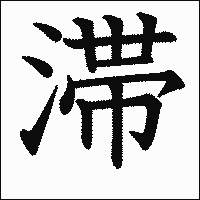

- ### Previous: [[Japanese 4]]
-
- # 27
  collapsed:: true
	- #card 罕見的；珍奇的；新穎的
	  collapsed:: true
		- 珍しい　めずらしい　４
	- #card 通學
	  collapsed:: true
		- 通学　つうがく　０
	- #card 新發售
	  collapsed:: true
		- 新発売　しんはつばい　３
	- #card 104，查號臺
	  collapsed:: true
		- １０４番　ひゃくよんばん　３
	- #card 實力
	  collapsed:: true
		- 実力　じつりょく　０
	- #card 積，存；積壓
	  collapsed:: true
		- ためる　０　他下一
	- #card [略語] 迪斯可舞廳
	  collapsed:: true
		- ディスコ　１
	- #card 勇氣
	  collapsed:: true
		- 勇気　ゆうき
		- https://kakijun.jp/gif-mini/0919200-m.gif
	- #card 告白，坦白
	  collapsed:: true
		- 告白する　こくはくする　０　他スル
	- #card 挑戰
	  collapsed:: true
		- 挑戦する　ちょうせんする　０　自スル
	- #card 煩惱，苦惱
	  collapsed:: true
		- 悩む　なやむ　２　自五
	- #card 高級
	  collapsed:: true
		- 高級（だ）　こうきゅう（だ）　０
		- https://kakijun.jp/gif-mini/09174200-m.gif
	- #card 澳大利亞，澳洲
	  collapsed:: true
		- オーストラリア　５
	- #card 商品
	  collapsed:: true
		- 商品　しょうひん　１
	- #card 檢定
	  collapsed:: true
		- 検定　けんてい　０
	- #card 簽約
	  collapsed:: true
		- 契約する　けいやくする　０　自他スル
		- https://kakijun.jp/gif-mini/0934200-m.gif
		- https://kakijun.jp/gif-mini/09177200-m.gif
	- #card 祕密
	  collapsed:: true
		- 秘密　ひみつ　０
	- #card 好不容易，難得；特意地
	  collapsed:: true
		- せっかく　０
	- #card 錯誤，出錯；　搞錯，弄錯
	  collapsed:: true
		- 間違う　まちがう　３　自五／他五
	- #card 紙幣，鈔票
	  collapsed:: true
		- お札　おさつ　０
	- #card 晒，晾；弄乾
	  collapsed:: true
		- 干す　ほす　１　他五
	- #card 臉色
	  collapsed:: true
		- 顔色　かおいろ　０
	- #card 適合；一致，符合
	  collapsed:: true
		- 合う　あう　１　自五
	- #card 輟學，退學
	  collapsed:: true
		- 中退する　ちゅうたいする　０　自スル
	- #card 離婚
	  collapsed:: true
		- 離婚する　りこんする　０　自スル
	- #card 訂購；要求，希望
	  collapsed:: true
		- 注文する　ちゅうもんする　０　他スル
	- #card 飲料
	  collapsed:: true
		- 飲み物　のみもの　２
	- #card 食具，餐具
	  collapsed:: true
		- 食器　しょっき　０
		- https://kakijun.jp/gif-mini/1507200-m.gif
	- #card 茶點
	  collapsed:: true
		- お茶菓子　おちゃがし　３
		- https://kakijun.jp/gif-mini/0967200-m.gif
		- https://kakijun.jp/gif-mini/1160200-m.gif
	- #card 人數
	  collapsed:: true
		- 人数　にんずう　１
	- #card 準備
	  collapsed:: true
		- 用意する　よういする　１　自他スル
	- #card 拭，擦拭
	  collapsed:: true
		- 拭く　ふく　０　他五
	- #card 日常，平日 (日常會話)
	  collapsed:: true
		- 日常（日常会話）　にちじょう（にちじょうかいわ）　０（５）
	- #card 更新，換新；刷新(紀錄等)
	  collapsed:: true
		- 更新する　こうしんする　０　他スル
	- #card 習慣
	  collapsed:: true
		- 習慣　しゅうかん　０
	- #card 氣候
	  collapsed:: true
		- 気候　きこう　０
	- #card 管理 (健康保健)
	  collapsed:: true
		- 管理（健康管理）　かんり（けんこうかんり）　１（５）
	- #card 辛勞；操心，費心
	  collapsed:: true
		- 苦労する　くろうする　１　自スル
		- https://kakijun.jp/gif-mini/0894200-m.gif
	- #card 確實地；規矩地
	  collapsed:: true
		- ちゃんと　０
	- #card 腐壞，腐爛
	  collapsed:: true
		- 腐る　くさる　２　自五
	- #card 冷凍庫
	  collapsed:: true
		- 冷凍室　れいとうしつ　３
	- #card 方便(與否)；情況
	  collapsed:: true
		- 都合　つごう　０
	- #card (表示重複某一固定的數量)
	  collapsed:: true
		- ～ずつ
	- #card 口信，留言
	  collapsed:: true
		- メッセージ　１
	- #card 觀光勝地
	  collapsed:: true
		- 観光地　かんこうち　３
	- #card 消息，資訊
	  collapsed:: true
		- 情報　じょうほう　０
	- #card 氣溫
	  collapsed:: true
		- 気温　きおん　０
- # 28
  collapsed:: true
	- #card 釣魚
	  collapsed:: true
		- 釣り　つり　０
	- #card 高興，喜悅
	  collapsed:: true
		- 喜ぶ　よろこぶ　３　自他五
	- #card 消失；盡，光；丟失
	  collapsed:: true
		- 無くなる　なくなる　０　自五
	- #card 迷路；猶豫，迷惑
	  collapsed:: true
		- 迷う　まよう　２　自五
	- #card 如果，假使，萬一
	  collapsed:: true
		- もし　１
	- #card 理解，領會；體諒
	  collapsed:: true
		- 理解する　りかいする　１　他スル
	- #card 地下道
	  collapsed:: true
		- 地下道　ちかどう　２、０
	- #card 體力
	  collapsed:: true
		- 体力　たいりょく　１
	- #card 戰爭，打仗
	  collapsed:: true
		- 戦争　せんそう　０
	- #card 和平；和睦
	  collapsed:: true
		- 平和　へいわ　０
	- #card 醒，清醒
	  collapsed:: true
		- 覚める　さめる　２　自下一
	- #card (時間、空間等) 經過；超過
	  collapsed:: true
		- 過ぎる　すぎる　２　自上一
	- #card 紅葉 (槭、楓)
	  collapsed:: true
		- 紅葉　こうよう　０
		- https://kakijun.jp/gif-mini/09176200-m.gif
		- https://kakijun.jp/gif-mini/1257200-m.gif
	- #card 比一般人更~
	  collapsed:: true
		- 人一倍　ひといちばい　０、４
	- #card 完全
	  collapsed:: true
		- 完全（だ）　かんぜん（だ）　０
	- #card 淚
	  collapsed:: true
		- 涙　なみだ　１
	- #card 手術
	  collapsed:: true
		- 手術　しゅじゅつ　１
	- #card 化妝品
	  collapsed:: true
		- 化粧品　けしょうひん　０
	- #card 詳細的；熟諳的
	  collapsed:: true
		- 詳しい　くわしい　３
	- #card 夠，足夠
	  collapsed:: true
		- 足りる　たりる　０　自上一
	- #card 出席
	  collapsed:: true
		- 出席する　しゅっせきする　０　自スル
	- #card 操作，操縱
	  collapsed:: true
		- 操作　そうさ　１
	- #card 重要的
	  collapsed:: true
		- 大事（だ）　だいじ（だ）　３、０
	- #card ~錢，~費用
	  collapsed:: true
		- ～代　～だい　０
	- #card 金融機構轉帳代繳
	  collapsed:: true
		- 引き落とし　ひきおとし　０
		- https://kakijun.jp/gif-mini/1258200-m.gif
	- #card 那樣的話
	  collapsed:: true
		- それなら　３
	- #card 有線電視
	  collapsed:: true
		- ケーブルテレビ　５
	- #card 加入，參加
	  collapsed:: true
		- 加入する　かにゅうする　０　自スル
	- #card 當日票
	  collapsed:: true
		- 当日券　とうじつけん　４
	- #card 券，票
	  collapsed:: true
		- 券　けん　１
	- #card 賣完，銷售一空
	  collapsed:: true
		- 売り切れる　うりきれる　４　自下一
		- https://kakijun.jp/gif-mini/0427200-m.gif
	- #card (電影院、舞廳等的)女性優惠日
	  collapsed:: true
		- レディースデー　４
	- #card 午夜場
	  collapsed:: true
		- レイトショー　３
	- #card 女性
	  collapsed:: true
		- 女性　じょせい　０
	- #card 以後~
	  collapsed:: true
		- 以降　いこう　１
- # 29
  collapsed:: true
	- #card 馬上，眼看就要
	  collapsed:: true
		- 今にも　いまにも　１
	- #card 只，僅，淨
	  collapsed:: true
		- ～ばかり
	- #card 上升；登，爬
	  collapsed:: true
		- 上がる　あがる　０　自五
	- #card 材料
	  collapsed:: true
		- 材料　ざいりょう　３
	- #card 剩餘；留下
	  collapsed:: true
		- 残る　のこる　２　自五
	- #card 增加，增多
	  collapsed:: true
		- 増える　ふえる　２　自下一
	- #card 擁擠
	  collapsed:: true
		- 混む　こむ　１　自五
		- 込む　こむ　１　自五
	- #card 才能
	  collapsed:: true
		- 才能　さいのう　０
	- #card 幸福
	  collapsed:: true
		- 幸せ（だ）　しあわせ（だ）　０
	- #card 為什麼
	  collapsed:: true
		- 何で　なんで　１
	- #card 爭吵，吵架
	  collapsed:: true
		- けんかする　０　自スル
	- #card 功能，機能
	  collapsed:: true
		- 機能　きのう　１
	- #card 花花公子，花心大蘿蔔
	  collapsed:: true
		- プレイボーイ　４
		- プレーボーイ　４
	- #card (交通)阻塞；遲滯
	  collapsed:: true
		- 渋滞　じゅうたい　０
		- 
	- #card 全~
	  collapsed:: true
		- 全～　ぜん～
	- #card 財產
	  collapsed:: true
		- 財産　ざいさん　１
	- #card 上司
	  collapsed:: true
		- 上司　じょうし　１
	- #card 錯失，錯過
	  collapsed:: true
		- 逃す　のがす　２　他五
	- #card 保護 (保護大自然)
	  collapsed:: true
		- 保護（自然保護）　ほご（しぜんほご）　１（４）
		- https://kakijun.jp/gif-mini/2009200-m.gif
	- #card 存款，儲蓄
	  collapsed:: true
		- 貯金する　ちょきんする　０　自他スル
	- #card (精神)壓力
	  collapsed:: true
		- ストレス　２
	- #card 解除
	  collapsed:: true
		- 解消する　かいしょうする　０　他スル
	- #card 求婚
	  collapsed:: true
		- プロポーズする　３　自スル
	- #card 不足 (運動不足)
	  collapsed:: true
		- 不足（運動不足）　ふそく（うんどうぶそく）　０（５）
	- #card 內容
	  collapsed:: true
		- 内容　ないよう　０
	- #card 文法
	  collapsed:: true
		- 文法　ぶんぽう　０
	- #card 體重
	  collapsed:: true
		- 体重　たいじゅう　０
	- #card 公斤
	  collapsed:: true
		- キロ　１
		- キログラム　３
	- #card 頭痛
	  collapsed:: true
		- 頭痛　ずつう　０
	- #card 果然；畢竟還是
	  collapsed:: true
		- やっぱり　３
		- やはり　２
	- #card 鹽
	  collapsed:: true
		- 塩　しお　２
	- #card (佐飯的)菜餚
	  collapsed:: true
		- おかず　０
	- #card 胡椒
	  collapsed:: true
		- こしょう　２
	- #card 量，數量，分量
	  collapsed:: true
		- 量　りょう　１
	- #card 失戀
	  collapsed:: true
		- 失恋　しつれん　０
	- #card (精神)打擊，衝擊；撞擊，震動
	  collapsed:: true
		- ショック　１
	- #card 心，精神，神志
	  collapsed:: true
		- 気　き　０
	- #card 細的，纖細的
	  collapsed:: true
		- 細い　ほそい　２
		- https://kakijun.jp/gif-mini/11183200-m.gif
	- #card 外表，姿態
	  collapsed:: true
		- 格好　かっこう　０
	- #card 上次
	  collapsed:: true
		- 前回　ぜんかい　１
	- #card 下次
	  collapsed:: true
		- 次回　じかい　１
	- #card 說話聲
	  collapsed:: true
		- 話し声　はなしごえ　４
	- #card 宿醉
	  collapsed:: true
		- 二日酔い　ふつかよい　０
	- #card (童話人物)小紅帽
	  collapsed:: true
		- 赤ずきんちゃん　あかずきんちゃん　３
	- #card (童話人物)大野狼；狼
	  collapsed:: true
		- おおかみ　１
	- #card 你 (男性稱親近的同輩、晚輩)
	  collapsed:: true
		- お前　おまえ　０
	- #card 嘴巴
	  collapsed:: true
		- 口　くち　０
	- #card 啊~！(尖叫聲)
	  collapsed:: true
		- キャーッ　１
- # 30
  collapsed:: true
	- #card 讚揚，稱讚，褒獎
		- 褒める　ほめる　２　他下一
	- #card 嚼；咬
		- かむ　１　他五
	- #card 愛，喜愛
		- 愛する　あいする　３　他スル
	- #card 警察
		- 警察　けいさつ　０
		- https://kakijun.jp/gif-mini/1912200-m.gif
	- #card 救助，幫助
		- 助ける　たすける　３　他下一
	- #card 父母
		- 親　おや　２
	- #card 拍，敲打，攻訐
		- たたく　２　他五
	- #card 高中生
		- 高校生　こうこうせい　３
	- #card 犯人
		- 犯人　はんにん　１
	- #card 揪住，抓住；捕捉
		- 捕まえる　つかまえる　０　他下一
	- #card 問，打聽
		- 尋ねる　たずねる　３　他下一
	- #card 吃醋，爭風吃醋
		- やきもち　３、４
	- #card 喪，死了
		- 亡くす　なくす　０　他五
	- #card 養育；教育，培養
		- 育てる　そだてる　３　他下一
		- https://kakijun.jp/gif-mini/08200200-m.gif
	- #card 半夜
		- 夜中　よなか　３
	- #card 近處，附近，近鄰
		- 近所　きんじょ　１
		- https://kakijun.jp/gif-mini/08118200-m.gif
	- #card 正直，誠實
		- 正直（だ）　しょうじき（だ）　３、４
		- https://kakijun.jp/gif-mini/08190200-m.gif
	- #card 信賴
		- 信頼する　しんらいする　０　他スル
	- #card 課長，科長
		- 課長　かちょう　０
	- #card 看家，看門；看門的人
		- 留守番　るすばん　０
	- #card 哭，哭泣
		- 泣く　なく　０　自五
	- #card 打開；開始，開設；舉辦
		- 開く　ひらく　２　他五
	- #card 驚訝，驚嘆，出乎意料
		- 驚く　おどろく　３　自五
		- https://kakijun.jp/gif-mini/2203200-m.gif
	- #card 抄，謄寫；拍照
		- 写す　うつす　２　他五
	- #card 包，包起來
		- 包む　つつむ　２　他五
	- #card 偷竊
		- 盗む　ぬすむ　２　他五
	- #card 輸入，進口
		- 輸入する　ゆにゅうする　０　他スル
	- #card 發現
		- 発見する　はっけんする　０　他スル
	- #card 發明
		- 発明する　はつめいする　０　他スル
	- #card 斟，倒入
		- つぐ　０　他五
	- #card 小偷，賊
		- 泥棒　どろぼう　０
	- #card 失敗
		- 失敗　しっぱい　０
	- #card 發音
		- 発音　はつおん　０
	- #card 肩膀
		- 肩　かた　１
		- https://kakijun.jp/gif-mini/08201200-m.gif
	- #card 撫摸
		- なでる　２　他下一
	- #card 前輩，先進；學長，學姊
		- 先輩　せんぱい　０
	- #card 大聲
		- 大声　おおごえ　３
	- #card 無顏見人的；害羞的
		- 恥ずかしい　はずかしい　４
	- #card 吃驚，嚇一跳
		- びっくりする　３　自スル
	- #card 慌張；急忙
		- 慌てる　あわてる　０　自下一
		- https://kakijun.jp/gif-mini/1281200-m.gif
	- #card 偷，扒竊
		- する　１　他五
	- #card 吠，咆哮
		- ほえる　２　自下一
	- #card 有人飼養的狗
		- 飼い犬　かいいぬ　０、１
	- #card 逃跑，逃走
		- 逃げる　にげる　２　自下一
	- #card 蜜蜂
		- 蜂　はち　０
	- #card 叮，螫；刺，扎
		- 刺す　さす　１　他五
	- #card 突然，忽然
		- 突然　とつぜん　０
		- https://kakijun.jp/gif-mini/08197200-m.gif
		- https://kakijun.jp/gif-mini/12145200-m.gif
	- #card 腫，腫脹
		- はれる　０　自下一
	- #card 倒，跌倒
		- 転ぶ　ころぶ　０　自五
	- #card 用力搔，抓
		- ひっかく　３　他五
	- #card 客滿，額滿
		- 満員　まんいん　０
	- #card (從高處、交通工具)下來
		- 降りる　おりる　２　自上一
	- #card 可憐的
		- かわいそう（だ）　４
	- #card 非常
		- 非常（だ）　ひじょう（だ）　０
	- #card 母親
		- 母親　ははおや　０
	- #card 哈啾！(打噴嚏的聲音)
		- ハクション　１
	- #card 唉呀！(表示難為情、驚訝、感動)
		- いやあ　２
	- #card 口罩；面具
		- マスク　１
	- #card 感冒藥
		- 風邪薬　かぜぐすり　３
		- https://kakijun.jp/gif-mini/08108200-m.gif
		- https://kakijun.jp/gif-mini/1616200-m.gif
	- #card 使離開
		- 離す　はなす　２　他五
	- #card 手臂，胳膊
		- 腕　うで　２
		- https://kakijun.jp/gif-mini/12190200-m.gif
	- #card 右手
		- 右手　みぎて　０
	- #card 高明的，美味的
		- うまい　２
	- #card 如果，萬一
		- もしも　１
	- #card 討厭的，不喜歡的
		- 嫌（だ）　いや（だ）　２
	- #card 當然，不用說
		- もちろん　２
	- #card 醉漢，醉鬼
		- 酔っ払い　よっぱらい　０
	- #card 突然，冷不防地
		- いきなり　０
	- #card 揍，毆打
		- 殴る　なぐる　２　他五
	- #card 拒絕，甩；搖，揮；撒(鹽等)
		- 振る　ふる　０　他五
	- #card 參考
		- 参考　さんこう　０
	- #card 110(報警專用電話號碼)
		- １１０番　ひゃくとおばん　３
	- #card 站務人員
		- 駅員　えきいん　２
	- #card 還手
		- 殴り返す　なぐりかえす　４　他五
	- #card 飼主
		- 飼い主　かいぬし　１、２
	- #card 嫌惡，厭惡
		- 嫌う　きらう　０　他五
	- #card 理由
		- 理由　りゆう　０
- # 31
  collapsed:: true
	- #card 昨夜，昨晚
		- 昨夜　さくや　２
	- #card 鑽石
		- ダイヤモンド　４
	- #card 寺廟，寺院
		- 寺　てら　２
		- https://kakijun.jp/gif-mini/0671200-m.gif
	- #card 僧
		- 僧　そう　１
		- https://kakijun.jp/gif-mini/1306200-m.gif
	- #card 舉行；實施，進行
		- 行う　おこなう　０　他五
		- 行なう　おこなう　０　他五
	- #card ~般，帶有~性質的
		- ～的　～てき　０
	- #card 歷史性的，有歷史意義的；歷史的
		- 歴史的（だ）　れきしてき（だ）　０
	- #card 遺產
		- 遺産　いさん　０
	- #card 相片集，寫真集
		- 写真集　しゃしんしゅう　２
		- https://kakijun.jp/gif-mini/10167200-m.gif
	- #card 出版
		- 出版する　しゅっぱんする　０　他スル
	- #card 廣播，播送
		- 放送する　ほうそうする　０　他スル
	- #card 製品，成品
		- 製品　せいひん　０
	- #card 輸出，出口
		- 輸出する　ゆしゅつする　０　他スル
	- #card 石油
		- 石油　せきゆ　０
	- #card 中東
		- 中東　ちゅうとう　０
	- #card 古典
		- 古典　こてん　０
	- #card 文學
		- 文学　ぶんがく　１
	- #card 研究
		- 研究する　けんきゅうする　０　他スル
	- #card ~會，~組織 (運動會)
		- ～会（運動会）　～かい（うんどうかい）　（３）
	- #card 半年
		- 半年　はんとし　４
	- #card 每~；每當~
		- ～ごと
	- #card 新~ (新製品，新產品)
		- 新～（新製品）　しん～（しんせいひん）　（３）
	- #card 開發；研製
		- 開発する　かいはつする　０　他スル
	- #card 乳酪，起司
		- チーズ　１
	- #card 油
		- 油　あぶら　０
	- #card 美乃滋
		- マヨネーズ　３
	- #card (男性)襯衫
		- ワイシャツ　０
	- #card 大豆，黃豆
		- 大豆　だいず　０
	- #card 醬油
		- しょうゆ　０
	- #card 硬紙板，瓦楞紙
		- 段ボール　ダンボール　３
	- #card 這些
		- これら　２
	- #card 家具
		- 家具　かぐ　１
		- https://kakijun.jp/gif-mini/0818200-m.gif
	- #card 糖，麥芽糖；糖果
		- あめ　０
	- #card 世界盃，世界運動會
		- ワールドカップ　５
	- #card 舉辦，召開
		- 開催する　かいさいする　０　他スル
	- #card 奧運，奧林匹克運動會
		- オリンピック　４
	- #card 希臘
		- ギリシャ　１
	- #card (希臘首都) 雅典
		- アテネ　１
	- #card 回憶
		- 思い出　おもいで　０
	- #card 關閉，封閉
		- 閉鎖する　へいさする　０　自他スル
	- #card 多，許多；大部分，大多數
		- 多く　おおく　１
	- #card 人們
		- 人々　ひとびと　２
	- #card 地域，地區
		- 地域　ちいき　１
	- #card 住民，居民
		- 住民　じゅうみん　０
	- #card 教會，教堂
		- 教会　きょうかい　０
	- #card 作曲
		- 作曲する　さっきょくする　０　自他スル
	- #card 諾貝爾獎
		- ノーベル賞　ノーベルしょう　４
	- #card 作家
		- 作家　さっか　０
	- #card 亞洲
		- アジア　１
	- #card 各國，諸國
		- 国々　くにぐに　２
	- #card 米
		- 米　こめ　２
	- #card 附~，附有~
		- ～付き　～つき　０
	- #card (電影)導演；教練
		- 監督　かんとく　０
	- #card 評價；估價，估計
		- 評価する　ひょうかする　１　他スル
	- #card 音樂廳
		- コンサートホール　６
	- #card 公開
		- 公開する　こうかいする　０　他スル
	- #card 展覽會
		- 展覧会　てんらんかい　３
	- #card 的確，誠然，果然
		- なるほど　０
	- #card 會館
		- 会館　かいかん　０
	- #card 珠寶店
		- 宝石店　ほうせきてん　４
	- #card 店長
		- 店長　てんちょう　１
	- #card 金庫，保險箱
		- 金庫　きんこ　１
	- #card 億
		- 億　おく　１
	- #card 被抓，被捕獲
		- 捕まる　つかまる　０　自五
	- #card 文化
		- 文化　ぶんか　１
	- #card 聯合國教育科學文化組織
		- ユネスコ　０、２
	- #card 保護
		- 保護する　ほごする　１　他スル
		- https://kakijun.jp/gif-mini/2009200-m.gif
	- #card 而且，再加上
		- それに　０
	- #card 登記，註冊
		- 登録する　とうろくする　０　他スル
	- #card ~處，~個，~個部分
		- ～か所　～かしょ　１
		- https://kakijun.jp/gif-mini/08118200-m.gif
	- #card 濕透，淋濕
		- びしょぬれ　０
	- #card 酒糟
		- さけかす　０
	- #card 參雜，混合；攪拌
		- 混ぜる　まぜる　２　他下一
	- #card 發酵
		- 発酵する　はっこうする　０　自他スル
	- #card 最後，最終
		- 最後　さいご　１
		- https://kakijun.jp/gif-mini/12107200-m.gif
	- #card 擰，絞；縮小
		- 絞る　しぼる　２　他五
		- https://kakijun.jp/gif-mini/12183200-m.gif
	- #card (嗅覺上的) 味道，氣味
		- 匂い　におい　２
	- #card 甜酒，糯米酒
		- 甘酒　あまざけ　０
	- #card 就這樣(維持原樣)
		- このまま　０
- # 32
  collapsed:: true
	- #card 真貨；真正，真本事
	- #card 預報 (氣象預報)
	- #card 大型
	- #card 絕佳的，極優秀的
	- #card 謠傳；背後議論
	- #card (狀態、程度) 極度，非常
	- #card 人氣，有人緣，受歡迎 (很受歡迎)
	- #card 總統
	- #card 辭職，辭官
	- #card 人體 (造成傷亡的交通事故)
	- #card 車內 (車廂內廣播)
	- #card 號外
	- #card 私費，自費
	- #card 留學生
	- #card 國費，公費
	- #card 漲價，價格上揚
	- #card 國會
	- #card 解散
	- #card 運勢
	- #card 週刊，週報 (週刊雜誌)
	- #card 財運
	- #card 零用錢
	- #card 博覽會
	- #card 村莊，鄉村
	- #card 陶瓷器的總稱；烤魚、烤雞等
	- #card 技術
	- #card 江戶時代 (西元1603~1867年)
	- #card 市長
	- #card 曲調，樂曲
	- #card 愛用，喜歡用
	- #card 會長，名譽理事長
	- #card 明治時代 (西元1868~1912年)
	- #card 歸國，回國
	- #card 員工旅遊
	- #card 事，要事；用途，作用
	- #card (若沒記錯的話) 應該，大概
	- #card (談話中思考時所發之語) 嗯…
	- #card 揭示，佈告 (公佈欄，佈告欄)
	- #card 募集，招募
	- #card 特快車
	- #card 非常喜悅，極其高興
	- #card 纜車，電纜車，空中纜車
	- #card 湖，湖泊
	- #card 遊船，觀光船
	- #card 杯麵
- # 33
  collapsed:: true
	- #card 繼續，連續；相連；相繼不斷
	- #card 市民會館
	- #card (患者)出院
	- #card 發售
	- #card 導覽書，引導說明手冊
	- #card 調職(至另一地點)
	- #card 常發生
	- #card 統計
	- #card 洪水
	- #card 都會性的
	- #card 進步的，具前瞻性的
	- #card 季節
	- #card 平靜的；(性情)沉穩的
	- #card 安全
	- #card ~性 (安全性)
	- #card 堤防
	- #card (一)週，(一)星期
	- #card 本人，當事人
	- #card [縮稱] 廣告
	- #card (有名)製造者，製造廠商
	- #card 海報
	- #card 皮膚
	- #card 退職，退休
	- #card 建設
	- #card 方法，辦法
	- #card 關係，交情
	- #card 馬拉松賽跑
	- #card 到，抵達
	- #card 燈泡，電燈泡
	- #card 更換，替換
	- #card 確認
	- #card 手指，腳趾
	- #card 護創膠布，OK繃
	- #card 截止，終止；截止期限
	- #card 面試
	- #card [縮稱] 數位相機
	- #card 對方，對象
	- #card [敬稱] 人
	- #card 任職，上班
-
- ### Next: [[Japanese 6]]